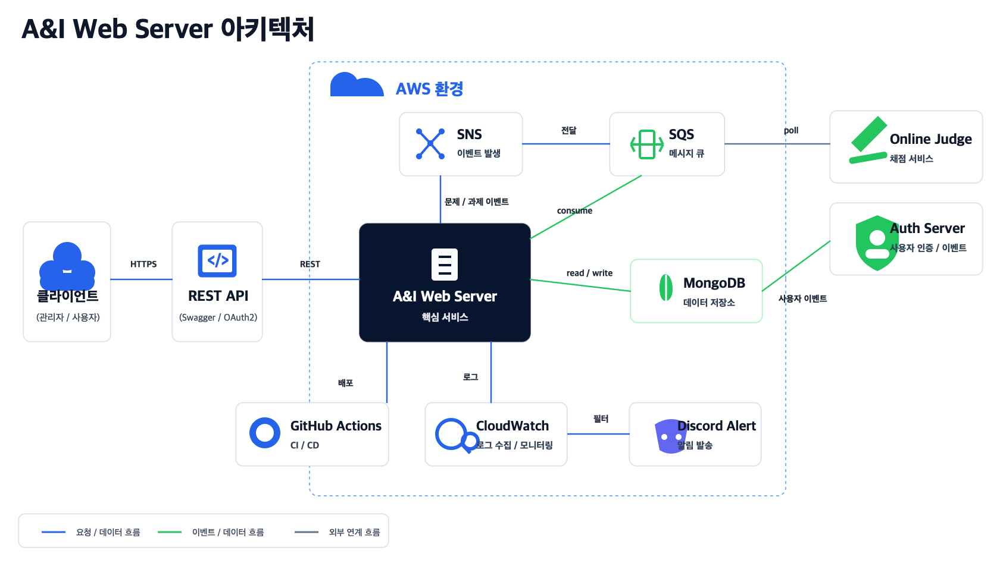
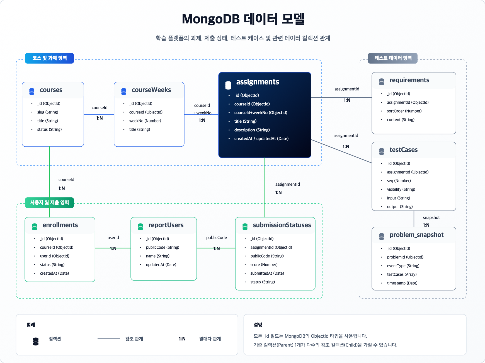
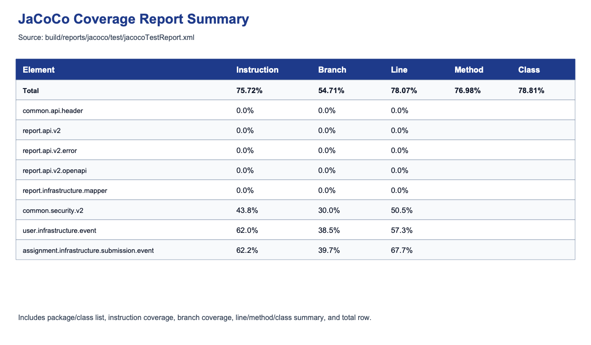

# A&I Assignment Platform

> 본 프로젝트는 A&I 동아리의 과제 공개, 테스트케이스 관리, Online Judge 동기화, 제출 결과 반영을 담당하는 과제 운영 백엔드입니다.

## 1. 왜 만들었나

A&I 과제 운영에서는 단순 CRUD보다 운영 시점의 일관성이 중요합니다. 공개 전 과제와 비공개 테스트케이스가 수강생에게 노출되면 안 되고, 과제 변경은 Online Judge 문제 데이터와 맞아야 하며, 채점 완료 결과는 관리자 제출 현황에 반영되어야 합니다.

이 서버는 과제 운영 데이터를 `MongoDB`에 저장하고, `AWS SNS/SQS` 이벤트로 WEB, AUTH, Online Judge 서버의 동기화 경로를 분리합니다. 운영 중 문제를 추적하기 위해 v2 API 요청과 오류는 `traceId`, `requestId`, `statusCode`, `latencyMs` 중심의 구조화 로그로 남깁니다.

## 2. 한눈에 보는 구조



- Client/Admin은 REST API와 Swagger UI로 서버에 접근합니다.
- A&I WEB-SERVER는 과제, 코스, 수강, 테스트케이스, 제출 상태 projection을 처리합니다.
- Assignment 변경 이벤트는 SNS Topic으로 발행되고, Online Judge는 SQS Queue 메시지를 소비해 problem/testcase를 동기화합니다.
- `JUDGE_COMPLETED`와 Auth user event는 SQS consumer가 받아 MongoDB projection과 report user 데이터를 갱신합니다.
- stdout JSON 로그는 CloudWatch Logs로 수집되고, Discord Alert는 allowlist 필드만 전달하는 기준으로 설계했습니다.

## 3. 데이터 모델



MongoDB 기반이라 정규화된 RDB ERD가 아니라 collection 간 참조와 이벤트 snapshot 흐름을 중심으로 정리했습니다.

| 영역 | 핵심 데이터 | 역할 |
| :--- | :--- | :--- |
| Assignment Operation | `assignments`, `testCases`, `requirements` | 과제 공개 상태, 테스트케이스 visibility, 요구사항 관리 |
| Submission Projection | `submissionStatuses`, `reportUsers` | judge completed 결과와 사용자 표시 정보 반영 |
| Event Message | problem sync snapshot, judge completed body | Online Judge 동기화와 제출 결과 반영 |

## 4. 핵심 기능과 동작 증거

### Assignment Operation

관리자는 과제를 생성하거나 공개 상태를 변경하고 테스트케이스를 연결합니다. 수강생 조회에서는 공개된 과제와 `PUBLIC` 테스트케이스만 응답합니다.

> GIF 예정: `docs/assets/gifs/assignment-operation.gif`
> 촬영 범위: API request/response로 과제 생성 또는 공개 상태 변경, 테스트케이스 연결 결과를 8초 내외로 캡처합니다.

### Online Judge Problem Sync

과제와 테스트케이스 snapshot 변경은 `PROBLEM_CREATED`, `PROBLEM_UPDATED`, `PROBLEM_DELETED` 이벤트로 발행됩니다. SNS/SQS 경로로 Online Judge가 동기화할 payload를 분리합니다.

> GIF 예정: `docs/assets/gifs/problem-sync.gif`
> 촬영 범위: Assignment 변경, SNS/SQS event 발행 로그, OJ 동기화 메시지를 8초 내외로 캡처합니다.

### Judge Completed Event

Online Judge의 `JUDGE_COMPLETED` 메시지는 SQS consumer가 소비하고 제출 상태 projection에 반영합니다. 비대상 이벤트와 파싱 실패는 reason 로그로 분리합니다.

> GIF 예정: `docs/assets/gifs/judge-completed.gif`
> 촬영 범위: `JUDGE_COMPLETED` 메시지 입력, consumer 처리 로그, report 상태 반영 결과를 8초 내외로 캡처합니다.

### Structured Logging

v2 API는 요청/응답과 오류를 JSON 로그로 남깁니다. 민감정보, private testcase, user submitted code 원문은 로그와 데모 화면에 노출하지 않는 기준으로 정리했습니다.

## 5. 테스트와 검증



2026년 06월 04일 KST 기준 로컬에서 Gradle 테스트와 JaCoCo 리포트를 확인했습니다.

| 항목 | 결과 |
| :--- | :--- |
| `./gradlew clean test` | 성공, 188 tests / 0 failures / 0 errors / 0 skipped |
| `./gradlew jacocoTestReport` | 성공 |
| `./gradlew jacocoTestCoverageVerification` | 성공 |
| JaCoCo line coverage | 2,289 / 2,932 = 78.07% |
| JaCoCo branch coverage | 761 / 1,391 = 54.71% |

## 6. 성능/쿼리 측정

현재 before/after 측정값은 없습니다.

성능 개선률, latency 개선률, SQS 처리량 개선률은 아직 이력서 문장으로 쓰지 않습니다. 대표 데이터셋과 MongoDB `executionStats`가 확보되면 같은 조건에서 before/after를 비교합니다.

상세 기준은 [MEASUREMENT](./docs/MEASUREMENT.md)에 기록했습니다.

## 7. 이력서에 연결할 문장

- A&I 과제 운영 백엔드에서 과제 공개, 테스트케이스 관리, Online Judge 동기화, 제출 결과 반영 흐름을 설계·운영했습니다.
- Assignment 변경 이벤트를 SNS/SQS 기반 problem sync 흐름으로 분리해 WEB-SERVER와 ONLINE-JUDGE-SERVER 간 동기화 경로를 명확히 했습니다.
- API 요청·오류 로그를 `traceId`, `requestId`, `statusCode`, `latencyMs` 중심으로 구조화해 운영 중 원인 추적이 가능하도록 정리했습니다.

## 8. 실행과 확인

```bash
docker compose up -d mongodb
./gradlew bootRun
```

```text
http://localhost:8080/swagger-ui/index.html
http://localhost:8080/actuator/health/readiness
```

GIF 촬영 실패 사유와 수동 촬영 기준은 [DEMO_CAPTURE](./docs/DEMO_CAPTURE.md)에 기록했습니다.
