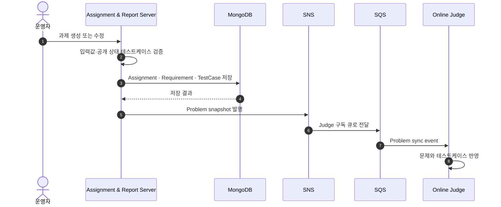
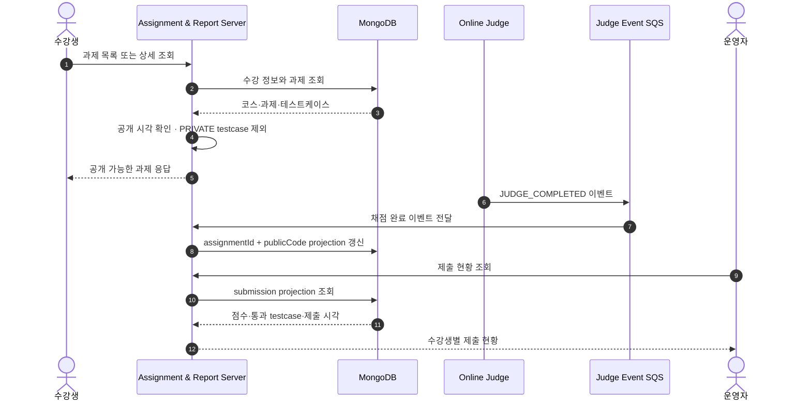
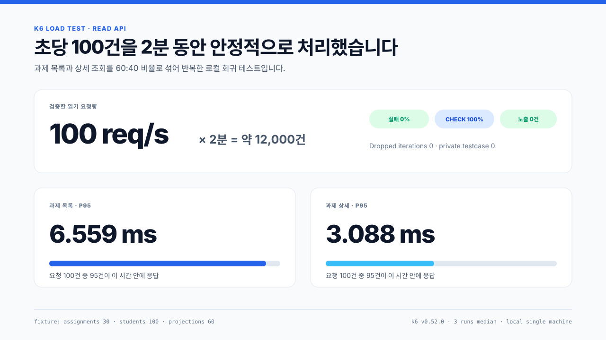

# A&I Assignment & Report Server

> 과제를 만들고 공개하는 순간부터 Online Judge의 채점 결과가 운영 화면에 반영되기까지를 담당하는 교육 운영 백엔드입니다.

저장소 이름은 `WEB-SERVER`지만 화면을 렌더링하는 서버는 아닙니다.

코스·수강·과제·요구사항·테스트케이스의 원본 데이터를 관리하고, 수강생과 운영자에게 필요한 API를 제공합니다.

과제가 변경되면 Online Judge가 사용할 problem snapshot을 이벤트로 전달하고, 채점 완료 이벤트는 관리자 조회에 적합한 submission projection으로 저장합니다.


## 이 서버가 맡는 일

| 구간 | 처리 내용 |
| :--- | :--- |
| 코스 운영 | 코스, 주차, 수강 정보와 접근 권한을 관리합니다. |
| 과제 운영 | 과제, 요구사항, 공개 시각, 테스트케이스를 관리합니다. |
| 수강생 조회 | 수강 여부와 공개 상태를 확인하고 공개 가능한 데이터만 반환합니다. |
| 문제 동기화 | 과제 변경 내용을 SNS/SQS 이벤트로 Online Judge에 전달합니다. |
| 제출 현황 | 채점 완료 이벤트를 과제·사용자 단위 projection으로 저장합니다. |
| 운영 추적 | 요청 ID, 상태 코드, 오류 코드, 지연시간을 구조화 로그로 남깁니다. |

## 과제가 Online Judge에 반영되는 흐름



서버가 Online Judge API를 동기 호출하지 않기 때문에 과제 운영과 채점 서버의 배포·장애 범위를 분리할 수 있습니다.

## 수강생 조회와 채점 결과 반영



공개 전 과제는 수강생 응답에서 존재 여부까지 드러나지 않도록 처리하고, 공개된 과제에서도 `PUBLIC` 테스트케이스만 반환합니다.

관리자 제출 현황은 Online Judge를 매번 호출하지 않고 MongoDB projection을 바로 조회해 읽기 경로를 짧게 유지합니다.

## 데이터 구조


MongoDB collection은 과제 원본 데이터와 제출 현황 projection의 목적을 나눠 관리합니다.

| 데이터 | 역할 |
| :--- | :--- |
| Course · Enrollment · Week | 코스 일정과 수강생 접근 범위 |
| Assignment · Requirement · TestCase | 과제 원본과 공개 데이터 |
| Submission Status Projection | 과제·사용자별 제출 여부와 최고 점수 |
| Event Snapshot | Online Judge 문제 동기화와 채점 결과 반영 |

## 화면으로 확인하기

운영자가 과제를 생성·수정하고 공개하는 흐름은 아래 영상에서 확인할 수 있습니다.

[과제 운영 데모 영상 보기](./docs/assets/videos/assignment-operation.mov)

수강생이 문제를 확인하고 채점 결과를 받는 흐름입니다.


## 성능과 테스트

### 자동화 테스트

2026년 6월 4일 기준 Gradle 테스트와 JaCoCo 검증 결과입니다.

| 검증 항목 | 결과 |
| :--- | :--- |
| 테스트 | **188 tests PASS** |
| 실패·오류·건너뜀 | **0 failures · 0 errors · 0 skipped** |
| JaCoCo line coverage | **78.07%** |
| JaCoCo branch coverage | **54.71%** |
| CI coverage 기준 | configured scope line **70% 이상** |
| Private testcase 노출 검사 | **0건** |


### 읽기 API 부하 테스트

합성 fixture에서 과제 목록과 상세 조회를 60:40 비율로 호출했습니다.



| 측정 조건 | 값 |
| :--- | :--- |
| Fixture | 과제 30개, 수강생 100명, 제출 projection 60개 |
| 부하 모델 | constant-arrival-rate, 100 RPS |
| 시간 | 2분 |
| 반복 | 3회 |
| k6 | v0.52.0 |

| 3회 중앙값 | 결과 |
| :--- | ---: |
| 과제 목록 P95 | **6.559 ms** |
| 과제 상세 P95 | **3.088 ms** |
| 성공 처리량 | **100.002 req/s** |
| HTTP 실패율 | **0.00%** |
| Check 성공률 | **100.00%** |
| Dropped iterations | **0** |
| Private testcase 노출 | **0건** |

초당 100건은 사용자 1명이 10초에 한 번 과제를 조회한다고 봤을 때 약 1,000명분의 읽기 트래픽이며, 실제 운영 용량은 배포 환경과 사용 패턴에 따라 달라집니다.

k6 check는 상태 코드뿐 아니라 대상 과제 존재 여부, 상세 응답 식별자, `PUBLIC` 테스트케이스만 포함되는지도 함께 확인합니다.

```bash
./gradlew clean test
./gradlew jacocoTestCoverageVerification

performance/k6/run-local.sh preflight performance/k6/env.local
performance/k6/run-local.sh assignment-read performance/k6/env.local
```

## 실행

```bash
docker compose up -d mongodb
./gradlew bootRun
```

```text
http://localhost:8080/swagger-ui/index.html
http://localhost:8080/actuator/health/readiness
```

## 기술 스택

| 영역 | 기술 |
| :--- | :--- |
| Language | Kotlin 1.9.25, Java 21 |
| Backend | Spring Boot 3.4.3, WebFlux |
| Database | MongoDB Reactive |
| Event | AWS SNS/SQS, AWS SDK |
| Security | Spring Security, OAuth2 Resource Server |
| Test | JUnit5, Kotest, Reactor Test, JaCoCo |
| Infra | Docker, GitHub Actions, AWS ECR/EC2, CloudWatch Logs |
| Performance | k6 |

## 참고 문서

- [테스트와 성능 측정](./docs/MEASUREMENT.md)
- [패키지 구조 원칙](./PACKAGE_STRUCTURE_GUIDE.md)
