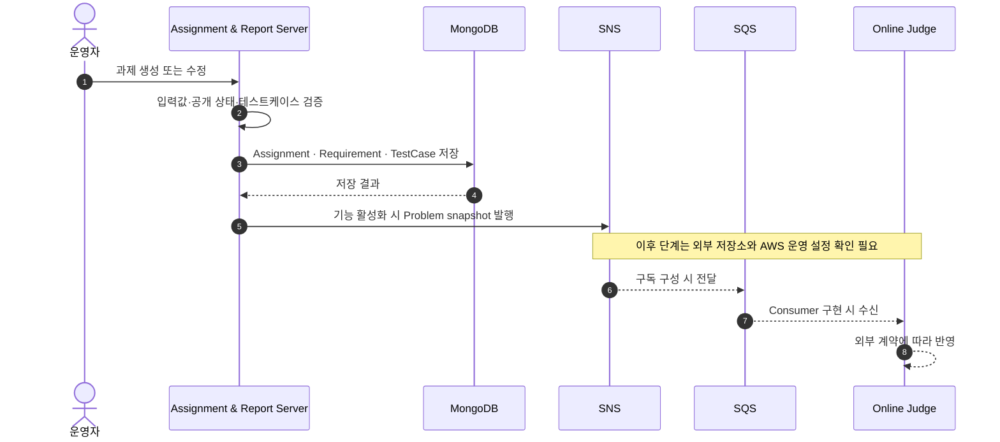
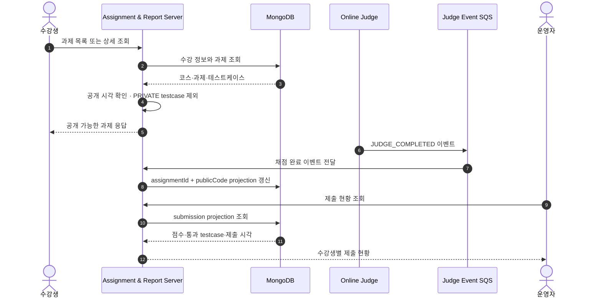

# A&I Assignment & Report Server

> 과제 원본을 운영하고, 기능 활성화 시 problem sync를 발행하며, 수신한 채점 결과를 운영 화면용 projection으로 저장하는 교육 운영 백엔드입니다.

저장소 이름은 `WEB-SERVER`지만 화면을 렌더링하는 서버는 아닙니다.

코스·수강·과제·요구사항·테스트케이스의 원본 데이터를 관리하고, 수강생과 운영자에게 필요한 API를 제공합니다.

problem sync 기능이 활성화된 환경에서는 과제 변경 시 Online Judge용 snapshot을 SNS에 발행합니다. Judge consumer가 활성화된 환경에서는 수신한 채점 완료 이벤트를 관리자 조회에 적합한 submission projection으로 저장합니다.


## 이 서버가 맡는 일

| 구간 | 처리 내용 |
| :--- | :--- |
| 코스 운영 | 코스, 주차, 수강 정보와 접근 권한을 관리합니다. |
| 과제 운영 | 과제, 요구사항, 공개 시각, 테스트케이스를 관리합니다. |
| 수강생 조회 | 수강 여부와 공개 상태를 확인하고 공개 가능한 데이터만 반환합니다. |
| 문제 동기화 | 기능 활성화 시 과제 변경 snapshot을 SNS에 발행합니다. 이후 전달·반영은 외부 구성 확인이 필요합니다. |
| 제출 현황 | 채점 완료 이벤트를 과제·사용자 단위 projection으로 저장합니다. |
| 운영 추적 | 요청 ID, 상태 코드, 오류 코드, 지연시간을 구조화 로그로 남깁니다. |

## 과제 problem snapshot 발행 흐름



`APP_EVENTS_REPORT_TEST_CASE_ENABLED`는 기본값이 `false`이며, 비활성 환경에서는 no-op publisher 단계가 성공 완료되어 publish 때문에 command가 실패하지 않습니다. 활성 환경에서 이 저장소가 확인하는 범위는 command 경로가 SNS publish 완료를 기다리고 성공·실패를 호출자에게 전파하는 지점까지입니다. Online Judge API를 직접 호출하지는 않지만 SNS 장애는 API 실패로 이어질 수 있으며, SNS 이후 SQS 전달과 Online Judge 반영은 외부 저장소·AWS 설정에서 별도로 확인해야 합니다.

## 수강생 조회와 채점 결과 반영



공개 전 과제는 수강생 응답에서 존재 여부까지 드러나지 않도록 처리하고, 공개된 과제에서도 `PUBLIC` 테스트케이스만 반환합니다.

관리자 제출 현황은 Online Judge를 매번 호출하지 않고 MongoDB projection을 바로 조회해 읽기 경로를 짧게 유지합니다.

`REPORT_JUDGE_SUBMISSION_EVENTS_ENABLED`도 기본값이 `false`입니다. 활성 환경에서 이 저장소가 확인하는 수신 범위는 `JUDGE_COMPLETED` 파싱, projection 저장, 성공 후 SQS 메시지 삭제까지입니다. Online Judge producer와 실제 queue/DLQ 설정은 외부 확인이 필요합니다.

## 데이터 구조


MongoDB collection은 과제 원본 데이터와 제출 현황 projection의 목적을 나눠 관리합니다.

| 데이터 | 역할 |
| :--- | :--- |
| Course · Enrollment · Week | 코스 일정과 수강생 접근 범위 |
| Assignment · Requirement · TestCase | 과제 원본과 공개 데이터 |
| Submission Status Projection | 과제·사용자별 제출 여부와 최고 점수 |

## 화면으로 확인하기

운영자가 과제를 생성·수정하고 공개하는 흐름은 아래 영상에서 확인할 수 있습니다.

[과제 운영 데모 영상 보기](./docs/assets/videos/assignment-operation.mov)

수강생이 문제를 확인하고 채점 결과를 받는 흐름입니다.


## 성능과 테스트

### 자동화 테스트

| 구분 | 테스트 | Line coverage | Branch coverage | CI 기준 | 직전 기준 대비 |
| :--- | ---: | ---: | ---: | :--- | :--- |
| 초기 기준 | 188 | 78.07% | 54.71% | Line 70% | - |
| 1차 리팩터링 | 277 | 85.04% | 62.59% | Line 83%, Branch 61% | +89 tests, Line +6.97%p, Branch +7.88%p |
| 2차 리팩터링 | 338 | 88.22% | 63.42% | Line 86%, Branch 62% | +61 tests, 측정 scope 확장 |
| 3차 리팩터링 | 388 | 88.87% | 63.74% | Line 86%, Branch 62% | +50 tests, Line +0.65%p, Branch +0.32%p |

초기 대비 테스트는 **188 → 388개(+200개, +106.4%)**, CI Line gate는 **70% → 86%(+16%p)**로 강화했습니다. 전체 coverage 수치는 Line **+10.80%p**, Branch **+9.03%p** 높아졌지만, 2차에서 측정 범위를 확장했으므로 동일 scope의 직접 개선치는 2차 → 3차의 Line **+0.65%p**, Branch **+0.32%p**를 기준으로 봅니다.


이미지는 2026-06-23 gate 보강 시점의 기록입니다. 과거 checkpoint와 scope 변경 이력은 [테스트와 성능 측정](./docs/MEASUREMENT.md)에 보존합니다. 현재 제외 대상은 Spring Boot 진입점과 OpenAPI schema-only 문서 모델뿐이며, 코루틴·controller·service·DTO·validator는 모두 측정합니다.

### 읽기 API 부하 테스트

과제 목록 조회에서 assignment마다 requirement와 testcase를 따로 조회하던 구조를 batch 조회로 변경했습니다.

| 항목 | Before | After |
| :--- | ---: | ---: |
| Child repository calls, 30 assignments | 60 | 2 |
| 감소율 | - | 96.67% |
| HTTP 실패율 | 0.00% | 0.00% |
| Check 성공률 | 100.00% | 100.00% |
| Dropped iterations | 0 | 0 |
| Private testcase 노출 | 0건 | 0건 |


100 RPS, 2분, 3회 반복 조건에서 확인했습니다. 고정 부하 테스트 결과이므로 최대 처리량으로 해석하지 않습니다.

상세 측정 조건과 per-run 결과는 [테스트와 성능 측정](./docs/MEASUREMENT.md)에 정리했습니다.

Resume 문장과 근거 상태는 [Resume Metrics](./docs/resume-metrics.md)에 따로 정리했습니다.

### 측정 지표 근거

| 지표 | 측정 조건 | 근거 |
| :--- | :--- | :--- |
| 자동화 테스트 388개, Line 88.87%, Branch 63.74% | 2026-07-11 KST, Course 관계 삭제 순차화 포함 | `docs/MEASUREMENT.md`, `build/reports/jacoco/test/jacocoTestReport.xml`, `build.gradle.kts` |
| Child repository calls 60 → 2 | 30 assignments, service-level repository interaction 기준 | `performance/results/assignment-read-query-evidence.json`, `AssignmentQueryServiceUserTest` |
| HTTP 실패율 0.00%, Check 성공률 100.00%, Dropped iterations 0 | local fixed-load, 100 RPS, 2분 × 3회, 목록 60%·상세 40% | `performance/results/assignment-read-before.aggregate.json`, `performance/results/assignment-read-after.aggregate.json` |
| Assignment list P95 9.297 ms → 7.565 ms | local fixed-load, 30 assignments, 목록 100%, 100 RPS, 2분 × 3회 | `docs/performance/results/2026-07-09-assignment-list-before-after.md` |

이 수치는 특정 commit / local fixed-load / documented measurement 기준이며 최대 처리량을 의미하지 않습니다.

## 실행

```bash
docker compose up -d mongodb
./gradlew bootRun
```

```text
http://localhost:8080/swagger-ui/index.html
http://localhost:8080/actuator/health/readiness
```

## 기술 스택

| 영역 | 기술 |
| :--- | :--- |
| Language | Kotlin 1.9.25, Java 21 |
| Backend | Spring Boot 3.4.3, WebFlux |
| Database | MongoDB Reactive |
| Event | AWS SNS/SQS, AWS SDK |
| Security | Spring Security, OAuth2 Resource Server |
| Test | JUnit5, Kotest, Reactor Test, JaCoCo |
| Infra | Docker, GitHub Actions, AWS ECR/EC2, CloudWatch Logs |
| Performance | k6 |

## 참고 문서

- [문서 안내와 상태 분류](./docs/README.md)
- [운영 배포와 복구](./docs/DEPLOYMENT.md)
- [안정적 리팩터링 계획](./docs/refactoring/2026-07-stable-refactoring.md)
- [과제 이벤트 계약과 outbox 전환 기준](./docs/ASSIGNMENT_EVENT_CONTRACT_RUNBOOK.md)
- [과제 이벤트 일관성 ADR](./docs/adr/0001-assignment-event-consistency.md)
- [테스트와 성능 측정](./docs/MEASUREMENT.md)
- [성능 결과 재현](./docs/performance/results/README.md)
- [N+1 개선기](https://velog.io/@stdiodh/%ED%85%8C%EC%8A%A4%ED%8A%B8%EC%99%80-k6%EB%A1%9C-%EA%B2%80%EC%A6%9D%ED%95%9C-%EA%B3%BC%EC%A0%9C-%EB%AA%A9%EB%A1%9D-N1-%EA%B0%9C%EC%84%A0%EA%B8%B0#%EC%A1%B0%ED%9A%8C-%ED%9A%9F%EC%88%98)
- [패키지 구조 원칙](./PACKAGE_STRUCTURE_GUIDE.md)
