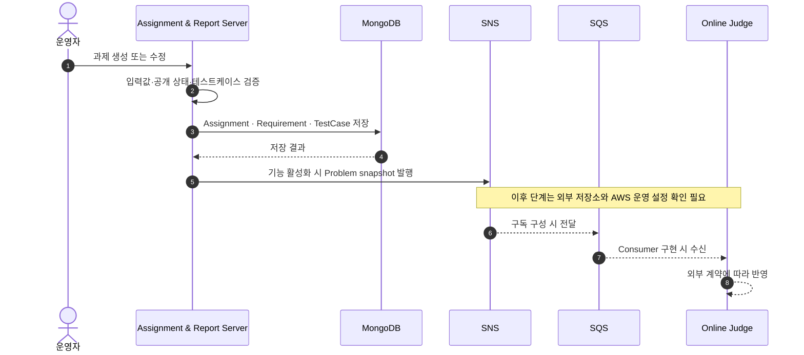
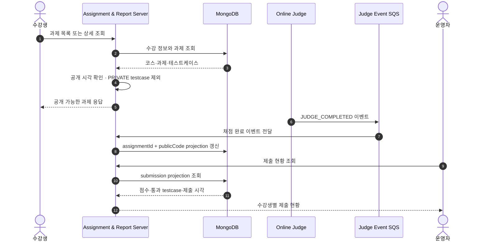

# A&I Assignment & Report Server

> 코스·과제 원본을 관리하고, 문제 동기화와 채점 결과 projection을 처리하는 교육 운영 백엔드입니다.

코스·수강·과제·요구사항·테스트케이스를 관리하고, 수강생과 운영자에게 필요한 API를 제공합니다.

기능 활성화 시 과제 변경 내용을 Online Judge용 problem snapshot으로 발행하고, 
채점 완료 이벤트를 관리자 조회용 submission projection으로 저장합니다.


## 주요 역할

| 구간     | 처리 내용                                |
| :----- | :----------------------------------- |
| 코스 운영  | 코스, 주차, 수강 정보와 접근 권한 관리              |
| 과제 운영  | 과제, 요구사항, 공개 시각, 테스트케이스 관리           |
| 수강생 조회 | 수강 여부와 공개 상태에 따라 데이터 반환              |
| 문제 동기화 | 과제 변경 snapshot을 SNS로 발행              |
| 제출 현황  | 채점 완료 이벤트를 과제·사용자 단위 projection으로 저장 |
| 운영 추적  | 요청 ID, 상태 코드, 오류 코드, 지연시간 기록         |

## 과제 problem snapshot 발행 흐름



`APP_EVENTS_REPORT_TEST_CASE_ENABLED=false`가 기본값입니다.

활성화하면 command 경로가 SNS publish 완료를 기다리며, SNS 실패는 API 실패로 전달됩니다. SNS 이후 SQS 전달과 Online Judge 반영은 외부 구성에 따라 동작합니다.

## 수강생 조회와 채점 결과 반영



공개 전 과제는 수강생에게 노출하지 않고, 공개된 과제에서도 `PUBLIC` 테스트케이스만 반환합니다.

관리자 제출 현황은 Online Judge를 직접 조회하지 않고 MongoDB projection을 사용합니다.

`REPORT_JUDGE_SUBMISSION_EVENTS_ENABLED=false`가 기본값이며, 활성화 시 `JUDGE_COMPLETED` 파싱 → projection 저장 → SQS 메시지 삭제까지 처리합니다.

## 데이터 구조


MongoDB는 과제 원본과 제출 상태 projection을 분리해 관리합니다.

| 데이터                                 | 역할              |
| :---------------------------------- | :-------------- |
| Course · Week · Enrollment          | 코스 일정과 수강 범위    |
| Assignment · Requirement · TestCase | 과제 원본과 공개 데이터   |
| Assignment Delivery                 | 사용자별 과제 전달 상태   |
| Submission Status Projection        | 과제·사용자별 제출 결과   |
| User                                | 사용자 조회용 동기화 데이터 |

## 화면으로 확인하기

운영자의 과제 생성·수정·공개 흐름입니다.

[과제 운영 데모 영상 보기](./docs/assets/videos/assignment-operation.mov)

수강생의 문제 조회와 채점 흐름입니다.


## 성능과 테스트


각 지표는 서로 다른 측정 조건의 결과이며 누적 효과로 해석하지 않습니다.

### 자동화 테스트

| 구분      |     테스트 | Line coverage | Branch coverage | CI 기준                    |
| :------ | ------: | ------------: | --------------: | :----------------------- |
| 초기 기준   |     188 |        78.07% |          54.71% | Line 70%                 |
| 1차 리팩터링 |     277 |        85.04% |          62.59% | Line 83%, Branch 61%     |
| 2차 리팩터링 |     338 |        88.22% |          63.42% | Line 86%, Branch 62%     |
| 3차 리팩터링 |     388 |        88.87% |          63.74% | Line 86%, Branch 62%     |
| 현재      | **456** |    **92.00%** |      **66.09%** | **Line 86%, Branch 62%** |

상세 내용은 [테스트와 성능 측정](./docs/MEASUREMENT.md)에서 확인할 수 있습니다.

### CI/CD 실행 시간

| 단계         | 기존 중앙값 | 개선 후 중앙값 |   개선율 |
| :--------- | -----: | -------: | ----: |
| 동일 범위 CI   | 140.0초 |   109.0초 | 22.1% |
| 문서-only CI | 124.0초 |    28.0초 | 77.4% |
| CD dry-run | 211.0초 |    82.0초 | 61.1% |

CI는 GitHub Actions 성공 실행 기준입니다.

상세 조건은 [CI/CD 최적화 측정](./docs/cicd-optimization.md)에 정리했습니다.

### 읽기 API 부하 테스트

과제마다 requirement와 testcase를 개별 조회하던 구조를 batch 조회로 변경했습니다.

| 항목                                     |  Before |      After |
| :------------------------------------- | ------: | ---------: |
| Child repository calls, 30 assignments |      60 |          2 |
| 감소율                                    |       - | **96.67%** |
| HTTP 실패율                               |   0.00% |      0.00% |
| Check 성공률                              | 100.00% |    100.00% |
| Dropped iterations                     |       0 |          0 |
| Private testcase 노출                    |      0건 |         0건 |

100 RPS, 2분, 3회 반복 기준입니다.

Assignment list P95는 **9.297 ms → 7.565 ms**로 확인했습니다.

상세 결과는 [테스트와 성능 측정](./docs/MEASUREMENT.md)에 정리했습니다.

## 실행

```bash
docker compose up -d mongodb
./gradlew bootRun
```

```text
http://localhost:8080/swagger-ui/index.html
http://localhost:8080/actuator/health/readiness
```

## 기술 스택

| 영역          | 기술                                                   |
| :---------- | :--------------------------------------------------- |
| Language    | Kotlin 1.9.25, Java 21                               |
| Backend     | Spring Boot 3.4.3, WebFlux                           |
| Database    | MongoDB Reactive                                     |
| Event       | AWS SNS/SQS, AWS SDK                                 |
| Security    | Spring Security, OAuth2 Resource Server              |
| Test        | JUnit5, Kotest, Reactor Test, JaCoCo                 |
| Infra       | Docker, GitHub Actions, AWS ECR/EC2, CloudWatch Logs |
| Performance | k6                                                   |

## 참고 문서

* [문서 안내](./docs/README.md)
* [운영 배포와 복구](./docs/DEPLOYMENT.md)
* [안정적 리팩터링](./docs/refactoring/2026-07-stable-refactoring.md)
* [과제 이벤트 계약](./docs/ASSIGNMENT_EVENT_CONTRACT_RUNBOOK.md)
* [과제 이벤트 일관성 ADR](./docs/adr/0001-assignment-event-consistency.md)
* [테스트와 성능 측정](./docs/MEASUREMENT.md)
* [성능 결과 재현](./docs/performance/results/README.md)
* [N+1 개선기](https://velog.io/@stdiodh/%ED%85%8C%EC%8A%A4%ED%8A%B8%EC%99%80-k6%EB%A1%9C-%EA%B2%80%EC%A6%9D%ED%95%9C-%EA%B3%BC%EC%A0%9C-%EB%AA%A9%EB%A1%9D-N1-%EA%B0%9C%EC%84%A0%EA%B8%B0#%EC%A1%B0%ED%9A%8C-%ED%9A%9F%EC%88%98)
* [패키지 구조 원칙](./PACKAGE_STRUCTURE_GUIDE.md)
