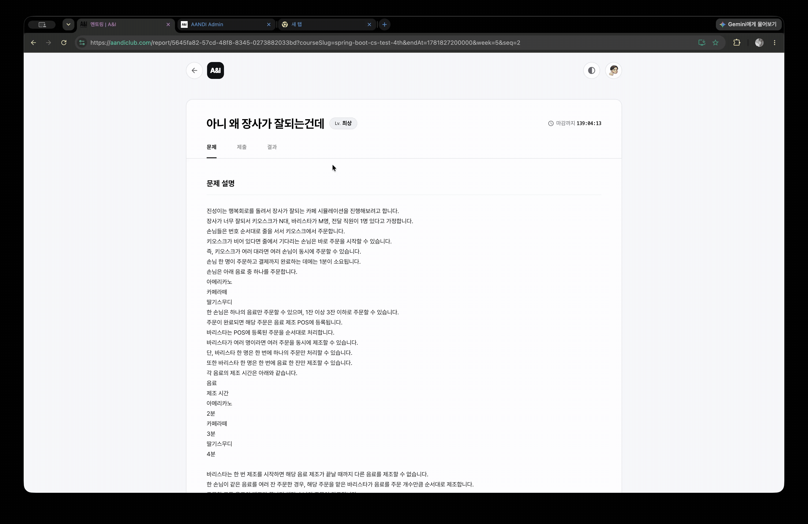

# A&I Assignment Platform

> A&I 동아리의 과제 공개, 테스트케이스 관리, Online Judge 동기화, 제출 결과 반영을 담당하는 과제 운영 백엔드입니다.

## 1. 프로젝트 요약

| 항목 | 내용 |
| :--- | :--- |
| 프로젝트 성격 | 과제 운영, 수강생 과제 조회, 제출 현황 projection을 처리하는 백엔드 서버 |
| 주요 구현 범위 | 백엔드 API, MongoDB 모델, SNS/SQS 이벤트 연동, 테스트/배포 구성 |
| 핵심 문제 | 공개 전 과제와 비공개 테스트케이스 노출 방지, Online Judge 문제 데이터 동기화, 채점 결과 반영 |
| 주요 검증 | 188 tests 통과, JaCoCo line coverage 78.07%, branch coverage 54.71% |
| 실행 환경 | Kotlin, Java 21, Spring Boot WebFlux, MongoDB, AWS SNS/SQS, Docker |

## 2. 왜 만들었나

A&I 과제 운영에서는 단순 CRUD보다 운영 시점의 일관성이 중요합니다. 공개 전 과제와 비공개 테스트케이스가 수강생에게 노출되면 안 되고, 과제 변경은 Online Judge 문제 데이터와 맞아야 하며, 채점 완료 결과는 관리자 제출 현황에 반영되어야 합니다.

이 프로젝트는 과제 운영 데이터를 MongoDB에 저장하고, AWS SNS/SQS 이벤트로 WEB, AUTH, Online Judge 서버의 동기화 경로를 분리하기 위해 만들었습니다. 운영 중 문제 추적을 위해 v2 API 요청과 오류는 `traceId`, `requestId`, `statusCode`, `latencyMs` 중심의 구조화 로그로 남깁니다.

## 3. 주요 구현 범위와 기여 영역

| 영역 | 구현 범위 |
| :--- | :--- |
| API 레이어 | 코스, 수강, 과제, 과제 활성화, 제출 현황 v2 API와 Swagger 문서 구성 |
| 데이터 모델 | `assignments`, `testCases`, `requirements`, `submissionStatuses`, `reportUsers` 중심의 MongoDB collection 구조 |
| 이벤트 연동 | Assignment 변경 이벤트 SNS 발행, Online Judge/Auth 이벤트 SQS consumer 기반 projection 갱신 |
| 노출 제어 | 공개 상태와 테스트케이스 visibility를 분리하고 수강생 조회 응답 범위를 제한 |
| 운영 관측성 | v2 API 요청·오류 로그를 JSON 구조로 기록하고 민감정보, private testcase, 제출 코드 원문은 로그에서 제외 |
| 품질/배포 | JUnit/Kotest 기반 테스트, JaCoCo coverage verification, GitHub Actions CI 구성 |

## 4. 한눈에 보는 구조


- Client/Admin은 REST API와 Swagger UI로 서버에 접근합니다.
- WEB-SERVER는 과제, 코스, 수강, 테스트케이스, 제출 상태 projection을 처리합니다.
- Assignment 변경 이벤트는 SNS Topic으로 발행되고, Online Judge는 SQS Queue 메시지를 소비해 problem/testcase를 동기화합니다.
- `JUDGE_COMPLETED`와 Auth user event는 SQS consumer가 받아 MongoDB projection과 report user 데이터를 갱신합니다.
- stdout JSON 로그는 CloudWatch Logs로 수집되며, Discord Alert는 allowlist 필드만 전달하는 기준으로 설계했습니다.

## 5. 데이터 모델


MongoDB 기반이라 정규화된 RDB ERD가 아니라 collection 간 참조와 이벤트 snapshot 흐름을 중심으로 설계했습니다.

| 영역 | 핵심 데이터 | 역할 |
| :--- | :--- | :--- |
| Assignment Operation | `assignments`, `testCases`, `requirements` | 과제 공개 상태, 테스트케이스 visibility, 요구사항 관리 |
| Submission Projection | `submissionStatuses`, `reportUsers` | judge completed 결과와 사용자 표시 정보 반영 |
| Event Message | problem sync snapshot, judge completed body | Online Judge 동기화와 제출 결과 반영 |

## 6. 핵심 기능과 동작 증거

### 6.1 Assignment Operation

관리자는 과제를 생성·수정·삭제하거나 전역 과제 활성화 상태를 변경할 수 있습니다. 수강생 조회에서는 접근 가능한 코스의 공개된 과제만 응답하도록 분리했습니다.

[Assignment Operation 데모 영상](./docs/assets/videos/assignment-operation.mov)

대표 API:

| Method | Endpoint | 설명 |
| :--- | :--- | :--- |
| `GET` | `/v2/courses/{courseSlug}/assignments` | 수강생이 접근 가능한 과제 목록 조회 |
| `GET` | `/v2/courses/{courseSlug}/assignments/{assignmentId}` | 과제 상세 조회 |
| `POST` | `/v2/admin/courses/{courseSlug}/assignments` | 관리자 과제 생성 및 OJ sync 이벤트 발행 |
| `PATCH` | `/v2/admin/courses/{courseSlug}/assignments/{assignmentId}` | 관리자 과제 수정 및 OJ sync 이벤트 발행 |
| `GET/PUT` | `/v2/admin/assignments/activation` | 전역 과제 활성화 상태 조회/변경 |

### 6.2 Problem View & Submission Status

수강생은 과제 상세 화면에서 문제, 제출, 결과 흐름을 확인합니다. 관리자는 Online Judge의 `JUDGE_COMPLETED` 이벤트가 반영된 projection을 기준으로 코스 수강생별 제출 현황을 조회합니다.



대표 API:

| Method | Endpoint | 설명 |
| :--- | :--- | :--- |
| `GET` | `/v2/admin/courses/{courseSlug}/assignments/{assignmentId}/submission-statuses` | 관리자용 과제 제출 현황 조회 |

### 6.3 Online Judge Problem Sync

과제 생성·수정·삭제 시 problem/testcase snapshot을 이벤트 payload로 만들고 SNS/SQS 경로로 Online Judge 서버와 동기화합니다. WEB-SERVER의 과제 운영 로직과 Online Judge의 채점 문제 데이터를 직접 결합하지 않고 이벤트 경로로 분리했습니다.

### 6.4 Structured Logging

v2 API는 요청/응답과 오류를 JSON 로그로 남깁니다. 추적에 필요한 `traceId`, `requestId`, `statusCode`, `latencyMs`는 남기되, JWT, Authorization header, private testcase, user submitted code 원문은 로그와 데모 화면에 노출하지 않는 기준으로 정리했습니다.

## 7. 기술적 고민과 해결

| 고민 | 해결 |
| :--- | :--- |
| 공개 전 과제와 비공개 테스트케이스 노출 위험 | 과제 공개 상태와 testcase visibility를 분리하고, 수강생 API 응답 범위를 제한 |
| WEB-SERVER와 Online Judge 간 데이터 불일치 | 과제 변경 시 problem sync snapshot 이벤트를 발행하고 OJ가 SQS로 소비하도록 분리 |
| 제출 결과 조회 시 실시간 채점 서버 의존 증가 | `JUDGE_COMPLETED` 이벤트를 projection에 반영하고 관리자 조회 API는 projection을 읽도록 구성 |
| v1/v2 API 혼재로 인한 구조 복잡도 | 버전 표기는 API 레이어에 두고 application/domain/infrastructure는 기능·계층 기준으로 정리 |
| 운영 중 장애 원인 추적 어려움 | 요청/오류 로그를 구조화하고 request 단위 추적 필드를 표준화 |

## 8. 테스트와 검증


2026년 06월 04일 KST 기준 로컬에서 Gradle 테스트와 JaCoCo 리포트를 확인했습니다.

| 항목 | 결과 |
| :--- | :--- |
| `./gradlew clean test` | 성공, 188 tests / 0 failures / 0 errors / 0 skipped |
| `./gradlew jacocoTestReport` | 성공 |
| `./gradlew jacocoTestCoverageVerification` | 성공 |
| JaCoCo line coverage | 2,289 / 2,932 = 78.07% |
| JaCoCo branch coverage | 761 / 1,391 = 54.71% |

확인되지 않은 latency, throughput, 성능 개선률은 작성하지 않습니다. 성능 수치는 대표 데이터셋과 MongoDB `executionStats`를 확보한 뒤 같은 조건에서 before/after를 비교합니다.

### 로컬 k6 부하 테스트

| 측정 조건 | 값 |
| :--- | :--- |
| 환경 | 로컬 Mac · MongoDB Docker |
| Fixture | 과제 30개 · 수강생 100명 · 제출 Projection 60개 |
| 시나리오 | 과제 목록 60% · 과제 상세 40% |
| 부하 | 100 RPS · 2분 |
| 반복 | 3회 |
| k6 | v0.52.0 |

| 결과 | 3회 중앙값 |
| :--- | ---: |
| 과제 목록 P95 | 6.559 ms |
| 과제 상세 P95 | 3.088 ms |
| 성공 처리량 | 100.002 req/s |
| HTTP 실패율 | 0.00% |
| Check 성공률 | 100.00% |
| Dropped iterations | 0 |

| 응답 검증 | 결과 |
| :--- | :--- |
| 과제 목록·상세 응답 계약 | 통과 |
| 요청한 과제 ID와 응답 ID 일치 | 통과 |
| 비공개 테스트케이스 노출 | 0건 |
| Private testcase guard | 100% |

> 로컬 합성 데이터에서 측정한 Baseline이며, 운영 최대 처리량이나 성능 개선율을 의미하지 않는다.

[실험 조건과 3회 실행 결과](./docs/performance/runs/2026-06-20-LOCAL-K6-BASELINE.md)

## 9. 실행 방법

```bash
docker compose up -d mongodb
./gradlew bootRun
```

```text
http://localhost:8080/swagger-ui/index.html
http://localhost:8080/actuator/health/readiness
```

Docker로 전체 로컬 환경을 실행할 수도 있습니다.

```bash
docker compose up -d --build
```

## 10. 기술 스택

| 구분 | 기술 |
| :--- | :--- |
| Language | Kotlin 1.9.25, Java 21 |
| Backend | Spring Boot 3.4.3, WebFlux, Validation, Actuator |
| Security | Spring Security, OAuth2 Resource Server |
| Database | MongoDB Reactive |
| Event | AWS SNS/SQS, AWS SDK |
| API Docs | springdoc-openapi WebFlux UI |
| Test | JUnit5, Kotest, Reactor Test, JaCoCo |
| Infra/CI/CD | Docker, Docker Compose, GitHub Actions, AWS ECR/EC2, CloudWatch Logs |

## 11. 관련 문서

| 문서 | 설명 |
| :--- | :--- |
| [Measurement](./docs/MEASUREMENT.md) | 테스트, 커버리지, 성능 측정 기준 |
| [Demo Capture](./docs/DEMO_CAPTURE.md) | README 이미지/GIF 촬영 기준과 민감정보 마스킹 규칙 |
| [Package Structure Guide](./PACKAGE_STRUCTURE_GUIDE.md) | 기능·계층 기준 패키지 구조와 신규 코드 배치 규칙 |
