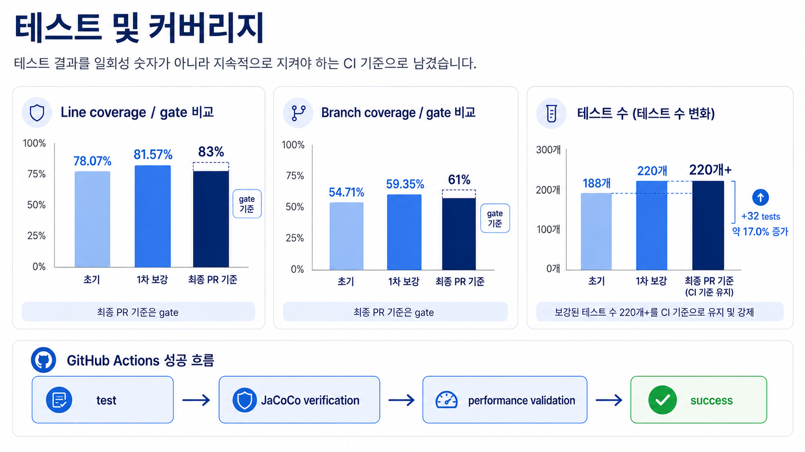
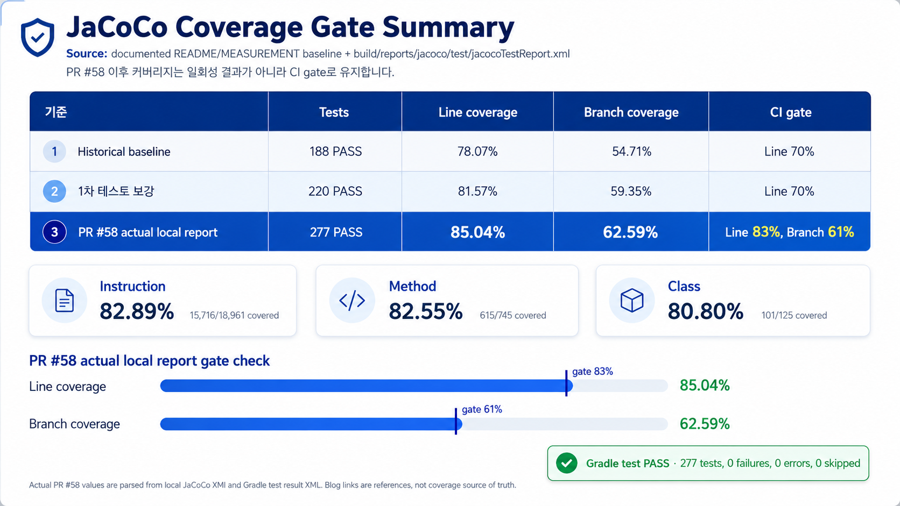

# 테스트와 성능 측정

> 테스트 개수나 P95 숫자만 강조하지 않고, 어떤 데이터와 조건으로 무엇을 확인했는지 함께 기록합니다.

> 이 문서의 188/277 테스트 수치는 과거 측정 기준입니다. 최신 품질 기준은 아래 `2026-07-11 현재 checkpoint`를 확인합니다.

[README로 돌아가기](../README.md)

이력서용 수치 근거는 [Resume Metrics](./resume-metrics.md)에 별도로 모읍니다.

## 테스트

2026-06-04 KST 기준으로 다음 명령을 실행했습니다.

```bash
./gradlew clean test
./gradlew jacocoTestReport
./gradlew jacocoTestCoverageVerification
./gradlew check
```

| 항목 | 결과 |
| :--- | :--- |
| 테스트 | 188 tests, 0 failures, 0 errors, 0 skipped |
| JaCoCo line coverage | 2,289 / 2,932 = **78.07%** |
| JaCoCo branch coverage | 761 / 1,391 = **54.71%** |
| CI verification | configured scope의 line coverage 70% 이상 |


Coverage는 당시 `build.gradle.kts`의 제외 규칙을 적용한 결과입니다.

당시에는 entity, repository, DTO, OpenAPI/config 일부, controller 일부와 일부 legacy service가 제외되어 있었으므로 전체 코드 기준 수치로 표현하지 않습니다.

### PR #58 이후 coverage gate와 블로그 정리

PR #58 이후 테스트 커버리지는 일회성 결과 수치보다 CI에서 지속적으로 검증하는 기준으로 관리합니다.

| 기준 | 테스트 수 | Line coverage | Branch coverage | CI gate |
| :--- | ---: | ---: | ---: | :--- |
| Historical baseline | 188 | 78.07% | 54.71% | Line 70% |
| 1차 테스트 보강 | 220 | 81.57% | 59.35% | Line 70% |
| PR #58 actual local report | 277 | 85.04% | 62.59% | Line 83%, Branch 61% |

`PR #58 actual local report` 행은 2026-06-23 KST에 생성한 `build/reports/jacoco/test/jacocoTestReport.xml`과 `build/test-results/test/TEST-*.xml`에서 읽은 값입니다. 같은 XML 기준 instruction 82.89%, method 82.55%, class 80.80%입니다.

PR #58의 최종 검증에서는 Gradle test, JaCoCo coverage verification, k6/performance asset validation이 모두 통과했습니다.





JaCoCo HTML report는 `build/reports/jacoco/test/html/index.html`에서 확인합니다. 로컬 screenshot 도구가 없어 HTML screenshot asset은 추가하지 않았습니다.

### 2026-07-10 JaCoCo scope 재조정

실패 경로 보강 PR #71 이후 같은 338개 테스트 실행 데이터로 제외 규칙만 단계별 재계산했습니다.

| 기준 | 테스트 수 | Line coverage | Branch coverage | CI gate |
| :--- | ---: | ---: | ---: | :--- |
| PR #71, 이전 configured scope | 338 | 2,819 / 3,133 = **89.98%** | 951 / 1,488 = **63.91%** | Line 83%, Branch 61% |
| 확장 scope | 338 | 4,233 / 4,798 = **88.22%** | 1,125 / 1,774 = **63.42%** | Line 86%, Branch 62% |

비율이 낮아진 것은 테스트 회귀가 아니라 측정 분모가 line 1,665개, branch 286개 늘어난 결과입니다. 실제 covered counter는 line 1,414개, branch 174개 증가했습니다.

제외 목록은 다음 세 패턴만 유지합니다.

- Spring Boot 진입점 `Application.class`
- Kotlin top-level 진입점 `ApplicationKt.class`
- 실행 로직이 없는 OpenAPI schema 문서 모델 `**/common/openapi/*EnvelopeDoc*`

기존 `**/*$*` 패턴은 코루틴과 람다로 컴파일된 service 로직까지 숨겼기 때문에 제거했습니다. Entity, repository, DTO, validator, config, controller, service는 package 단위로 제외하지 않습니다.

새 gate는 측정값보다 line 2.22%p, branch 1.42%p 낮게 두어 작은 변경의 변동 여유를 확보하면서도 기존 기준보다 강화했습니다. Scope나 제외 규칙이 다시 바뀌면 기존 비율과 직접 비교하지 않고 covered/missed counter를 함께 기록합니다.

관련 블로그 정리: [테스트와 k6로 검증한 과제 목록 N+1 개선기](https://velog.io/@stdiodh/%ED%85%8C%EC%8A%A4%ED%8A%B8%EC%99%80-k6%EB%A1%9C-%EA%B2%80%EC%A6%9D%ED%95%9C-%EA%B3%BC%EC%A0%9C-%EB%AA%A9%EB%A1%9D-N1-%EA%B0%9C%EC%84%A0%EA%B8%B0#%EC%A1%B0%ED%9A%8C-%ED%9A%9F%EC%88%98)

### 2026-07-11 현재 checkpoint

서비스 경계, MongoDB 인덱스 계약, 사용자 tombstone 이벤트 순서, 과제 조회 경계 테스트를 추가한 뒤 같은 expanded scope와 gate로 다시 측정했습니다.

| 테스트 수 | Line coverage | Branch coverage | CI gate |
| ---: | ---: | ---: | :--- |
| 372 | 4,415 / 4,979 = **88.67%** | 1,140 / 1,790 = **63.69%** | Line 86%, Branch 62% |

MongoDB 인덱스 migration JavaScript의 12개 단위 테스트는 `node --test`로 별도 실행하며 위 Gradle 테스트 수와 JaCoCo 분자·분모에는 포함하지 않습니다.

숫자보다 다음 규칙을 우선적으로 테스트합니다.

- 공개 전 과제와 private testcase 비노출
- 과제 복사 중복 방지와 부분 실패 정리
- 이벤트 파싱과 submission projection 갱신
- 동시 갱신 충돌 재시도
- 공통 오류 응답과 구조화 로그 마스킹

## k6 읽기 baseline, historical

### 목적

과제 목록과 상세 조회의 현재 기준을 남겨 이후 query 개선 전후를 같은 조건으로 비교합니다.

운영 최대 처리량이나 전체 이벤트 파이프라인 성능을 주장하기 위한 결과가 아닙니다.

### 환경

| 항목 | 값 |
| :--- | :--- |
| 측정일 | 2026-06-20 KST |
| 측정 대상 SHA | `718ff0ee2ad25a323ea8fb9120151c6845ea7ea1` |
| Java | OpenJDK 21.0.8, Eclipse OpenJ9 0.53.0 |
| MongoDB | Docker standalone, 7.0.37 |
| k6 | v0.52.0 |
| 머신 | Apple M5 Pro, 48 GiB |
| 부하 모델 | constant-arrival-rate |
| 부하 | 100 RPS, 2분, 3회 |
| 요청 비율 | 목록 60%, 상세 40% |

### Fixture

| 데이터 | 개수 |
| :--- | ---: |
| Course | 1 |
| Course week | 3 |
| Assignment | 30 |
| Enrollment | 100 |
| Submission projection | 60 |

Private testcase 검증을 위해 `PERF_PRIVATE_MUST_NOT_LEAK_001` marker를 fixture에 포함했습니다.

### 3회 중앙값

| 항목 | 결과 |
| :--- | ---: |
| 과제 목록 P50 | 4.912 ms |
| 과제 목록 P95 | **6.559 ms** |
| 과제 목록 P99 | 8.997 ms |
| 과제 상세 P50 | 2.209 ms |
| 과제 상세 P95 | **3.088 ms** |
| 과제 상세 P99 | 4.420 ms |
| 성공 처리량 | **100.002 req/s** |
| HTTP 실패율 | **0.00%** |
| Check 성공률 | **100.00%** |
| Dropped iterations | **0** |
| Private testcase 노출 | **0건** |

k6 check는 상태 코드뿐 아니라 다음 계약도 확인합니다.

- target assignment가 목록에 존재하는가
- 상세 응답의 `assignmentId`와 `courseSlug`가 요청과 일치하는가
- 응답 testcase가 `PUBLIC`만 포함하는가
- private marker가 노출되지 않는가

## 과제 목록 child lookup batching 비교

> 이 섹션은 2026-06-23의 historical 60:40 혼합 부하 측정입니다. 과제 목록만 분리한 최신 before/after latency 근거는 `docs/performance/results/2026-07-09-assignment-list-before-after.md`에 고정합니다.

### 목적

과제 목록 조회가 assignment마다 requirement와 testcase를 따로 조회하던 구조를 batch 조회로 바꿨을 때의 query 효율과 fixed-rate latency 변화를 같은 로컬 환경에서 비교합니다.

이 결과는 위 historical baseline과 측정 환경이 다르므로 historical baseline 대비 개선율을 계산하지 않습니다.

### 조건

| 항목 | 값 |
| :--- | :--- |
| 측정일 | 2026-06-23 KST |
| Before SHA | `d787f671598a9f69953bbba33d910442937f118f` |
| After SHA | `08a2a21bebff9e0a74c0f808dfa873f0eaa9c062` |
| Java | OpenJDK 21.0.6, Homebrew |
| MongoDB | local standalone, 7.0.16 |
| k6 | v0.52.0 |
| 머신 | Apple M5 Pro, 48.00 GiB |
| Fixture fingerprint | `005fc5cdb43a402413b263ae38b5565a73634b25bc7532cef346320ad295cf1a` |
| Fixture | Course 1, Course week 3, Assignment 30, Enrollment 100, Submission projection 60 |
| 부하 모델 | constant-arrival-rate |
| 부하 | 100 RPS, 2분, 3회 |
| 요청 비율 | 목록 60%, 상세 40% |
| VU allocation | preAllocatedVUs 30, maxVUs 200 |
| Request sleep | 1초 설정, arrival-rate에서는 sleep 미적용 |
| Warm-up | run-local warmup 완료 |
| Preflight | run-local preflight 통과 |

### 비교 공식

```text
Latency improvement (%) = ((before P95 - after P95) / before P95) * 100
Latency delta (ms) = after P95 - before P95
Query reduction (%) = ((before query count - after query count) / before query count) * 100
Throughput improvement (%) = ((after throughput - before throughput) / before throughput) * 100
```

positive latency improvement는 latency 감소를 뜻합니다.

fixed 100 RPS 시나리오의 처리량은 부하 발생기가 고정한 값이므로 용량 증가 근거로 해석하지 않습니다.

### Query comparison

서비스 레벨 repository interaction 기준입니다. MongoDB command count로 주장하지 않습니다.

| Fixture assignments | Before child repository calls | After child repository calls | Reduction |
| :------------------ | ----------------------------: | ---------------------------: | --------: |
| 30 | 60 | 2 | 96.67% |

Before 구조는 assignment 30개 기준 requirement 단건 조회 30회와 testcase 단건 조회 30회로 예상되는 `2N` child lookup입니다.

After 구조는 requirement batch 조회 1회와 testcase batch 조회 1회입니다. `CourseQueryServiceUserAssignmentTest`는 0, 1, 30 assignments에서 batch 호출 수와 단건 child 조회 미사용을 검증합니다.

### Explain summary

추가 인덱스는 만들지 않았습니다.

| Query | winningPlan | indexName | totalDocsExamined | totalKeysExamined | nReturned | executionTimeMillis |
| :--- | :--- | :--- | ---: | ---: | ---: | ---: |
| assignment list, `courseId` filter and `weekNo/orderInWeek` sort | FETCH | `ux_assignment_course_week_order` | 30 | 30 | 30 | 0 |
| requirements batch, `assignmentId in (...)` | FETCH | `ux_assignment_requirement_sort` | 30 | 30 | 30 | 0 |
| testcases batch, `assignmentId in (...)` | FETCH | `ux_assignment_test_case_seq` | 90 | 90 | 90 | 0 |

### Per-run values

| Side | Run | List P50 | List P95 | List P99 | Detail P95 | Business success throughput | HTTP failure | Check success | Dropped |
| :--- | :--- | ---: | ---: | ---: | ---: | ---: | ---: | ---: | ---: |
| Before | 1 | 6.506 ms | 8.084 ms | 10.222 ms | 3.822 ms | 99.999 req/s | 0.00% | 100.00% | 0 |
| Before | 2 | 6.610 ms | 8.472 ms | 10.771 ms | 3.570 ms | 99.999 req/s | 0.00% | 100.00% | 0 |
| Before | 3 | 6.238 ms | 7.612 ms | 10.234 ms | 3.062 ms | 100.005 req/s | 0.00% | 100.00% | 0 |
| After | 1 | 6.213 ms | 8.006 ms | 10.016 ms | 4.272 ms | 99.999 req/s | 0.00% | 100.00% | 0 |
| After | 2 | 6.558 ms | 7.923 ms | 9.000 ms | 3.810 ms | 100.002 req/s | 0.00% | 100.00% | 0 |
| After | 3 | 6.609 ms | 8.064 ms | 9.638 ms | 3.901 ms | 100.004 req/s | 0.00% | 100.00% | 0 |

Private testcase guard는 모든 run에서 100%였습니다.

### Median comparison

| Metric | Before median | After median | Change |
| :--- | ---: | ---: | :--- |
| Assignment list P50 | 6.506 ms | 6.558 ms | +0.052 ms, 0.80% regression |
| Assignment list P95 | 8.084 ms | 8.006 ms | -0.077 ms, +0.96% nominal latency improvement |
| Assignment list P99 | 10.234 ms | 9.638 ms | -0.596 ms, +5.82% latency improvement |
| Assignment detail P95 | 3.570 ms | 3.901 ms | +0.331 ms, 9.29% regression |
| Business success throughput | 99.999 req/s | 100.002 req/s | +0.002 req/s, fixed-rate reference |
| HTTP failure rate | 0.00% | 0.00% | 유지 |
| Check success rate | 100.00% | 100.00% | 유지 |
| Dropped iterations | 0 | 0 | 유지 |
| Private testcase leaks | 0 | 0 | 유지 |

### Interpretation

strict aggregate comparison은 context 일치를 확인했고 accepted=true입니다.

Assignment list P95 중앙값은 0.96% 낮아졌지만 before/after run range가 겹치므로 latency 개선으로 단정하지 않습니다.

Assignment list P99는 낮아졌고 child repository call은 60에서 2로 줄었습니다. 이 PR의 주 근거는 반복 child 조회를 batch 조회로 변경한 query 효율 개선입니다.

Assignment detail 경로는 이번 변경 대상이 아니며 P95 중앙값은 상승했습니다. fixed-rate 100 RPS 결과만으로 최대 처리량 증가를 주장하지 않습니다.

### Artifacts

| Artifact | Path |
| :--- | :--- |
| Before raw summaries | `performance/results/assignment-read-2026-06-22T17-31-36-700Z-d787f67.summary.json`, `performance/results/assignment-read-2026-06-22T17-33-54-832Z-d787f67.summary.json`, `performance/results/assignment-read-2026-06-22T17-36-06-142Z-d787f67.summary.json` |
| After raw summaries | `performance/results/assignment-read-2026-06-22T17-50-14-635Z-08a2a21.summary.json`, `performance/results/assignment-read-2026-06-22T17-52-26-529Z-08a2a21.summary.json`, `performance/results/assignment-read-2026-06-22T17-54-39-325Z-08a2a21.summary.json` |
| Aggregates | `performance/results/assignment-read-before.aggregate.json`, `performance/results/assignment-read-after.aggregate.json` |
| Strict comparison | `performance/results/assignment-read-comparison.json`, `performance/results/assignment-read-comparison.md` |

## 실행

```bash
performance/fixtures/run-fixture.sh cleanup
performance/fixtures/run-fixture.sh seed
performance/fixtures/run-fixture.sh verify
python3 performance/k6/tools/generate_test_jwt.py --output performance/k6/env.local
MONGO_DB_URL=mongodb://localhost:27017/aandi_performance ./gradlew bootRun
```

다른 터미널에서 실행합니다.

```bash
performance/k6/run-local.sh preflight performance/k6/env.local
performance/k6/run-local.sh assignment-read performance/k6/env.local
performance/k6/run-local.sh submission-status-read performance/k6/env.local
```

production 대상 부하 테스트는 스크립트에서 차단합니다.

원격 실행은 HTTPS staging과 명시적인 host allowlist가 모두 설정된 경우에만 허용합니다.

## 비교 기준

before/after 비교는 다음 조건이 같을 때만 유효합니다.

- fixture fingerprint와 데이터 개수
- JVM, MongoDB mode, 하드웨어와 k6 버전
- executor, target RPS, duration, endpoint 비율
- warm-up 여부와 check 결과

조건이 다르면 개선율을 계산하지 않습니다.

## 다음 측정

30 assignment list-only before/after 측정은 `docs/performance/results/2026-07-09-assignment-list-before-after.md`에 정리했습니다.

남은 확장 측정은 scale fixture에서 반복 child 조회 batch화 효과를 더 분명히 확인하는 작업입니다. 구체적인 list-only 재측정 절차는 [과제 목록 API 응답 시간 측정 계획](./ASSIGNMENT_LIST_LATENCY_PLAN.md)에 정리합니다.

1. 과제 300, 1,000개 fixture를 같은 before/after commit pair로 준비합니다.
2. 각 fixture 크기에서 before/after를 같은 조건으로 다시 측정합니다.
3. P95/P99와 explain 기반 `totalDocsExamined`, `totalKeysExamined`를 함께 기록합니다.
4. 최대 처리량 주장이 필요하면 fixed 100 RPS가 아닌 별도 capacity scenario를 정의합니다.

그다음에는 event pipeline을 별도로 측정합니다. 아래 항목은 아직 README 또는 resume 성과로 사용하지 않습니다.

- [미구현] Outbox 도입 후 SNS 장애 상황의 유실 이벤트 건수
- [확인 필요] event publish lag P95
- [확인 필요] duplicate event 재전달 시 projection 중복 건수
- [확인 필요] SQS oldest message age와 DLQ 유입 건수
