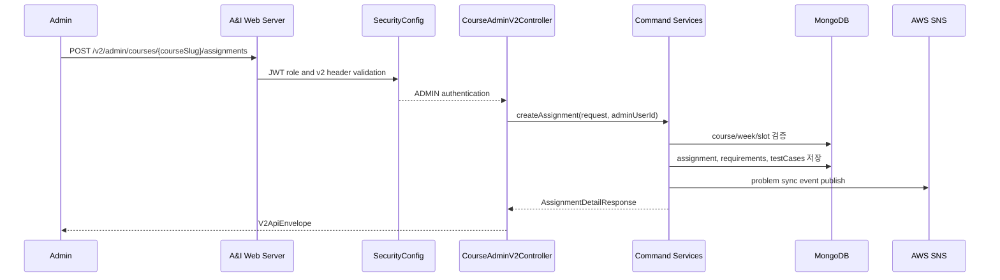

# 관리자 코스/과제 관리 흐름

## 1. 이 흐름이 필요한 이유

관리자는 코스를 만들고 수강생을 등록한 뒤, 주차별 과제와 테스트케이스를 운영한다.
이 흐름은 코스 운영 데이터 저장과 OJ 문제 동기화의 시작점이기 때문에 관리자 권한과 중복 검증이 함께 필요하다.

## 2. 참여 컴포넌트

| 컴포넌트 | 역할 |
| :--- | :--- |
| `CourseAdminV2Controller` | 관리자 코스/수강/과제 API 진입점 |
| `CourseV1Service` | v1/v2 API 호환 계층 |
| `CourseCommandService` | 코스 생성/수정/삭제, 과제 생성/수정/삭제 |
| `CourseEnrollmentCommandService` | 수강생 등록/상태 변경/삭제 |
| `AssignmentCopyService` | 과제 복사와 중복 방지 |
| Repository 계층 | 코스, 주차, 수강, 과제, 요구사항, 테스트케이스 저장 |
| `MongoDB` | 운영 데이터 저장소 |

## 3. 동작 과정 요약

1. 관리자가 ADMIN 권한 JWT로 `/v2/admin/courses/**` API를 호출한다.
2. 서버는 role을 확인하고 v2 헤더를 검증한다.
3. 코스 생성/수정/삭제 요청은 `CourseCommandService`가 처리한다.
4. 수강생 등록/상태 변경/삭제 요청은 `CourseEnrollmentCommandService`가 처리한다.
5. 과제 생성/수정/삭제/복사는 과제 슬롯 중복, 날짜, 테스트케이스 형식을 검증한다.
6. 과제 변경이 끝나면 필요 시 OJ problem sync 이벤트가 발행된다.

## 4. API / Event 계약

### Course

| Method | Path | 설명 |
| :--- | :--- | :--- |
| `GET` | `/v2/admin/courses` | 전체 코스 목록 조회 |
| `POST` | `/v2/admin/courses` | 코스 생성 |
| `PATCH` | `/v2/admin/courses/{courseSlug}` | 코스 수정 |
| `DELETE` | `/v2/admin/courses/{courseSlug}` | 코스 삭제 |

### Enrollment

| Method | Path | 설명 |
| :--- | :--- | :--- |
| `POST` | `/v2/admin/courses/{courseSlug}/enrollments` | 수강생 등록 |
| `PATCH` | `/v2/admin/courses/{courseSlug}/enrollments/{userId}` | 수강 상태 변경 |
| `DELETE` | `/v2/admin/courses/{courseSlug}/enrollments/{userId}` | 수강생 삭제 |
| `GET` | `/v2/admin/courses/{courseSlug}/enrollments` | 수강생 목록 조회 |

### Assignment

| Method | Path | 설명 |
| :--- | :--- | :--- |
| `GET` | `/v2/admin/courses/{courseSlug}/assignments` | 관리자 과제 목록 조회 |
| `GET` | `/v2/admin/courses/{courseSlug}/assignments/{assignmentId}` | 관리자 과제 상세 조회 |
| `POST` | `/v2/admin/courses/{courseSlug}/assignments` | 과제 생성 |
| `POST` | `/v2/admin/courses/{targetCourseSlug}/assignments/copy` | 과제 복사 |
| `PATCH` | `/v2/admin/courses/{courseSlug}/assignments/{assignmentId}` | 과제 수정 |
| `DELETE` | `/v2/admin/courses/{courseSlug}/assignments/{assignmentId}` | 과제 삭제 |

## 5. Sequence Diagram

## 6. 예외 흐름

| 상태 | 조건 |
| :--- | :--- |
| `400` | 날짜 역전, 잘못된 slug/UUID/weekNo, 테스트케이스 검증 실패 |
| `401` | 인증 실패 |
| `403` | ADMIN 권한 없음 |
| `404` | 코스, 주차, 과제, 수강생, 원본 과제를 찾을 수 없음 |
| `409` | 코스 slug 중복, 동일 코스/주차/순번 과제 중복, 동일 과제 복사 중복 |
| `422` | 수강 등록 대상 사용자가 report 서버에 동기화되어 있지 않음 |

## 7. 확인한 코드 위치

- `src/main/kotlin/com/example/aandi_post_web_server/course/api/v2/controller/CourseAdminV2Controller.kt`
- `src/main/kotlin/com/example/aandi_post_web_server/course/application/service/CourseCommandService.kt`
- `src/main/kotlin/com/example/aandi_post_web_server/course/application/service/CourseEnrollmentCommandService.kt`
- `src/main/kotlin/com/example/aandi_post_web_server/assignment/application/service/AssignmentCopyService.kt`
- `src/main/kotlin/com/example/aandi_post_web_server/course/infrastructure/repository/CourseRepository.kt`
- `src/main/kotlin/com/example/aandi_post_web_server/assignment/infrastructure/repository/AssignmentRepository.kt`

## 8. README에는 이렇게 요약한다

관리자는 코스, 수강생, 과제를 운영하고 과제 복사를 수행한다. 과제 변경은 MongoDB 저장과 OJ problem sync 이벤트 발행으로 이어진다.
