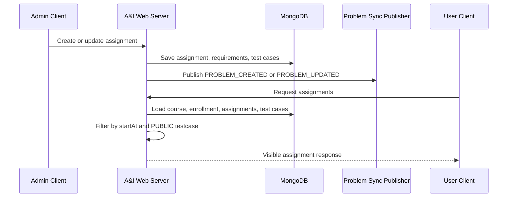
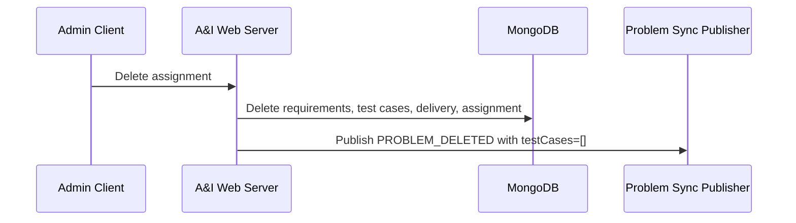

# Assignment Lifecycle

> 상위 문서로 돌아가기: [API / Event Flow Index](./README.md)

본 문서는 과제 생성, 수정, 삭제, 공개 상태 계산, 테스트케이스 관리 흐름을 정리합니다.

## 주요 API 책임

| 영역 | 설명 | 주요 코드 |
| :--- | :--- | :--- |
| 관리자 과제 생성 | 코스/주차/순번 기준 과제를 생성하고 요구사항/테스트케이스를 저장합니다. | `CourseCommandService` |
| 관리자 과제 수정 | 과제 메타데이터, 요구사항, 테스트케이스를 전체 교체하고 problem sync를 재발행합니다. | `CourseCommandService` |
| 관리자 과제 삭제 | 과제 관련 requirement/testcase/delivery를 삭제하고 `PROBLEM_DELETED` 이벤트를 발행합니다. | `CourseCommandService` |
| 과제 복사 | origin assignment와 fingerprint로 중복 복사를 막고 새 과제를 생성합니다. | `AssignmentCopyService` |
| 사용자 과제 조회 | 수강 상태와 `startAt` 기준 공개 상태를 확인합니다. | `CourseQueryService` |

## 공개 상태 기준

`Assignment.status`가 `PUBLISHED`여도 현재 시간이 `startAt`보다 이르면 사용자 응답에서는 `DRAFT`처럼 취급됩니다.

| 조건 | 사용자 조회 결과 |
| :--- | :--- |
| `status != PUBLISHED` | 조회 불가 |
| `status == PUBLISHED` and `now < startAt` | 조회 불가 |
| `status == PUBLISHED` and `now >= startAt` | 조회 가능 |

## 테스트케이스 응답 기준

| 조회자 | 테스트케이스 visibility |
| :--- | :--- |
| 사용자 | `PUBLIC`만 응답 |
| 관리자 | hidden/private 성격의 visibility 포함 |
| OJ problem sync | `EXCLUDED`를 제외한 snapshot 전송 |

## Sequence

## 삭제 흐름

## 검증 근거

- `CourseCommandServiceTest`: 과제 생성/수정/삭제와 problem sync 이벤트 타입 검증
- `CourseQueryServiceTest`: 사용자 조회, 공개 상태, 권한 흐름 검증
- `AssignmentTestCaseValidatorTest`: 테스트케이스 validation 검증

## 관련 문서

- [Problem Sync](./problem-sync.md)
- [과제 공개 및 조회 흐름](./assignment-publish-flow.md)
- [관리자 코스/과제 관리 흐름](./admin-course-assignment-flow.md)
- [Assignment Copy Troubleshooting](../troubleshooting/assignment-copy.md)
