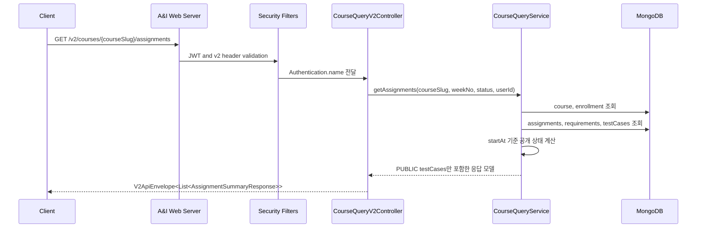

# 과제 공개 및 조회 흐름

## 1. 이 흐름이 필요한 이유

수강생은 자신이 등록된 코스와 공개된 과제만 조회해야 한다.
이 서버는 별도 공개 스케줄러가 아니라 `startAt`과 현재 시각을 비교해 사용자 응답에서 과제 상태를 계산한다.

관리자 API에서는 숨김 테스트케이스까지 볼 수 있지만, 사용자 조회 API는 `PUBLIC` 테스트케이스만 응답한다.

## 2. 참여 컴포넌트

| 컴포넌트 | 역할 |
| :--- | :--- |
| `CourseQueryV2Controller` | `/v2/courses` 사용자 조회 API 진입점 |
| `AssignmentCourseV2Controller` | 과제 ID로 접근 가능한 코스를 조회 |
| `CourseV1Service` | v1/v2 컨트롤러와 서비스 사이의 호환 계층 |
| `CourseQueryService` | 수강 여부 확인, 과제 공개 상태 계산, 응답 조립 |
| `CourseRepository`, `CourseEnrollmentRepository` | 코스와 수강 정보 조회 |
| `AssignmentRepository`, `AssignmentRequirementRepository`, `AssignmentTestCaseRepository` | 과제, 요구사항, 테스트케이스 조회 |
| `MongoDB` | 코스/과제 데이터 저장소 |

## 3. 동작 과정 요약

1. 사용자가 `v2` 코스/과제 조회 API에 Bearer 토큰과 v2 헤더를 보낸다.
2. 서버는 JWT를 검증하고 사용자 ID를 `Authentication.name`으로 전달한다.
3. `CourseQueryService`는 사용자가 해당 코스에 `ENABLED` 상태로 등록되어 있는지 확인한다.
4. 과제 조회 시 `Assignment.status`가 `PUBLISHED`여도 현재 시각이 `startAt`보다 이르면 응답 상태를 `DRAFT`로 계산한다.
5. 사용자 응답에는 공개된 과제와 `PUBLIC` 테스트케이스만 포함한다.

## 4. API / Event 계약

| Method | Path | 설명 |
| :--- | :--- | :--- |
| `GET` | `/v2/courses` | 로그인한 사용자의 수강 코스 목록 |
| `GET` | `/v2/courses/{courseSlug}` | 접근 가능한 코스 상세 |
| `GET` | `/v2/courses/{courseSlug}/outline` | 코스 헤더와 과제 요약 |
| `GET` | `/v2/courses/{courseSlug}/weeks` | 코스 주차 목록 |
| `GET` | `/v2/courses/{courseSlug}/weeks/{weekNo}/assignments` | 주차별 과제 목록 |
| `GET` | `/v2/courses/{courseSlug}/assignments` | 코스 과제 목록 |
| `GET` | `/v2/courses/{courseSlug}/assignments/{assignmentId}` | 과제 상세 |
| `GET` | `/v2/assignments/{assignmentId}/course` | 과제가 속한 접근 가능 코스 |

`v2` 응답은 `success`, `data`, `error`, `timestamp`를 포함한 `V2ApiEnvelope` 구조를 사용한다.

## 5. Sequence Diagram

## 6. 예외 흐름

| 상태 | 조건 |
| :--- | :--- |
| `400` | `weekNo`, `assignmentId`, `courseSlug`, `status` 형식이 잘못됨 |
| `401` | 토큰 없음 또는 JWT 검증 실패 |
| `404` | 코스/과제를 찾을 수 없거나 사용자가 해당 코스에 등록되어 있지 않음 |
| `404` | 과제가 아직 공개되지 않았거나 사용자에게 접근 권한이 없음 |

## 7. 확인한 코드 위치

- `src/main/kotlin/com/example/aandi_post_web_server/course/api/v2/controller/CourseQueryV2Controller.kt`
- `src/main/kotlin/com/example/aandi_post_web_server/course/api/v2/controller/AssignmentCourseV2Controller.kt`
- `src/main/kotlin/com/example/aandi_post_web_server/course/application/service/CourseQueryService.kt`
- `src/main/kotlin/com/example/aandi_post_web_server/common/api/envelope/V2ApiEnvelope.kt`

## 8. README에는 이렇게 요약한다

수강 중인 사용자는 코스와 과제를 조회하고, 서버는 `startAt` 기준으로 공개 상태를 계산한다. 사용자 응답에는 공개된 과제와 `PUBLIC` 테스트케이스만 포함한다.
