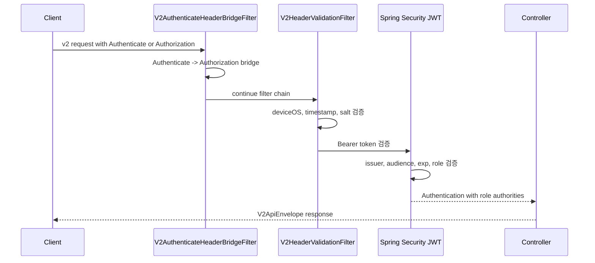

# v2 인증 및 권한 흐름

## 1. 이 흐름이 필요한 이유

코스/과제 조회 API는 로그인한 사용자에게만 열려 있고, 관리자 API는 ADMIN 권한이 필요하다.
이 서버는 로그인 토큰을 직접 발급하지 않고, 전달받은 JWT를 검증하는 Resource Server로 동작한다.

## 2. 참여 컴포넌트

| 컴포넌트 | 역할 |
| :--- | :--- |
| `SecurityConfig` | WebFlux Security 설정, JWT decoder, role 기반 인가 |
| `V2AuthenticateHeaderBridgeFilter` | `Authenticate` 헤더를 `Authorization` 헤더로 브리지 |
| `V2HeaderValidationFilter` | `deviceOS`, `timestamp`, 선택적 `salt` 검증 |
| `JwtPolicyProperties` | issuer, audience, secret, clock skew 설정 |
| `AccessTokenClaimsValidator` | access token claim 검증 |
| `UserRole` | JWT role claim을 Spring Security authority로 변환 |
| `GlobalApiExceptionHandler` | v2 에러 응답을 공통 envelope로 변환 |

## 3. 동작 과정 요약

1. 클라이언트는 `Authenticate: Bearer {accessToken}` 또는 `Authorization: Bearer {accessToken}`을 보낸다.
2. `V2AuthenticateHeaderBridgeFilter`는 `Authenticate` 값을 `Authorization`으로 복사한다.
3. `V2HeaderValidationFilter`는 `deviceOS`, `timestamp`, 선택적 `salt`를 검증한다.
4. JWT decoder는 HS256 secret, issuer, audience, timestamp를 검증한다.
5. JWT `role` claim은 `ROLE_USER`, `ROLE_ORGANIZER`, `ROLE_ADMIN` 권한으로 변환된다.
6. `/v2/admin/courses/**`는 ADMIN 권한만 접근한다.

## 4. API / Event 계약

### Required Headers for v2 authenticated requests

| Header | 설명 |
| :--- | :--- |
| `Authenticate` 또는 `Authorization` | `Bearer {accessToken}` 형식 |
| `deviceOS` | 클라이언트 OS 식별 |
| `timestamp` | epoch milliseconds 또는 ISO-8601 |
| `salt` | 선택값. `APP_REPORT_V2_SALT_SECRET`이 있으면 `md5(timestamp + secret)` 검증 |

### Protected Paths

| Path | 권한 |
| :--- | :--- |
| `/v2/admin/courses/**` | `ROLE_ADMIN` |
| `/api/v2/admin/courses/**` | `ROLE_ADMIN` |
| `/v1/admin/**` | `ROLE_ADMIN` |
| `/v1/courses/**` | `ROLE_USER`, `ROLE_ORGANIZER`, `ROLE_ADMIN` |
| `/v2/**` | `ROLE_USER`, `ROLE_ORGANIZER`, `ROLE_ADMIN` |
| `/api/v2/**` | `ROLE_USER`, `ROLE_ORGANIZER`, `ROLE_ADMIN` |

## 5. Sequence Diagram

## 6. 예외 흐름

| 상태 | 조건 |
| :--- | :--- |
| `400` | v2 헤더 형식 오류 또는 `salt` 검증 실패 |
| `401` | Bearer 토큰 없음, 만료, issuer/audience/claim 검증 실패 |
| `403` | 필요한 role이 없음 |
| `500` | JWT secret이 32 bytes보다 짧은 등 서버 설정 오류 |

## 7. 확인한 코드 위치

- `src/main/kotlin/com/example/aandi_post_web_server/common/security/SecurityConfig.kt`
- `src/main/kotlin/com/example/aandi_post_web_server/common/security/v2/V2AuthenticateHeaderBridgeFilter.kt`
- `src/main/kotlin/com/example/aandi_post_web_server/common/security/v2/V2HeaderValidationFilter.kt`
- `src/main/kotlin/com/example/aandi_post_web_server/common/security/JwtPolicyProperties.kt`
- `src/main/kotlin/com/example/aandi_post_web_server/common/security/UserRole.kt`
- `src/main/resources/application.yml`

## 8. README에는 이렇게 요약한다

`v2` API는 Bearer JWT와 공통 헤더를 검증하고, role claim을 기준으로 사용자 API와 관리자 API 접근을 분리한다.
