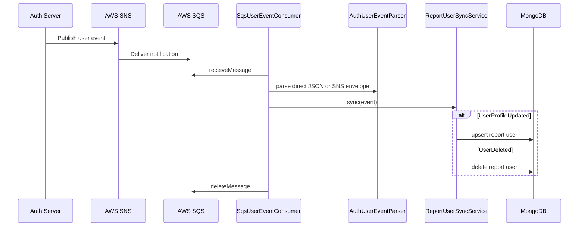

# Auth User Sync

> 상위 문서로 돌아가기: [API / Event Flow Index](./README.md)

본 문서는 Auth Server의 사용자 이벤트를 A&I Web Server의 `report_users` 데이터로 동기화하는 흐름을 정리합니다.

## Event payload

```json
{
  "eventType": "UserProfileUpdated",
  "eventId": "event-id",
  "occurredAt": "2026-04-09T02:15:30.123Z",
  "id": "user-id",
  "publicCode": "A00123",
  "username": "demo-user",
  "role": "USER",
  "nickname": "Demo",
  "profileImageUrl": "https://example.com/profile.png",
  "updatedAt": "2026-04-09T02:15:30.123Z"
}
```

`AuthUserEvent`는 `eventType/type`, `id/userId` alias를 지원합니다.

## Event type 기준

| 이벤트 | 처리 |
| :--- | :--- |
| `UserProfileUpdated` | report user upsert |
| `UserDeleted` | report user delete |

## Consumer flow



## stale event 기준

`ReportUserSyncService`는 `updatedAt`을 우선 사용하고, 없으면 `occurredAt`을 사용합니다.

| 조건 | 결과 |
| :--- | :--- |
| event time >= stored updatedAt | upsert/delete 반영 |
| event time < stored updatedAt | `IGNORED_STALE` |
| event time 없음 | `IllegalArgumentException` |

## 설정 기준

| 설정 | 설명 |
| :--- | :--- |
| `APP_EVENTS_USER_SYNC_ENABLED` | consumer 활성화 |
| `APP_EVENTS_USER_SYNC_QUEUE_URL` | SQS queue URL |
| `APP_EVENTS_USER_SYNC_REGION` | AWS region, 기본 `ap-northeast-2` |
| `APP_EVENTS_USER_SYNC_WAIT_TIME_SECONDS` | long polling wait time |
| `APP_EVENTS_USER_SYNC_MAX_NUMBER_OF_MESSAGES` | batch message count |

## 실패 처리 기준

| 상황 | 처리 |
| :--- | :--- |
| parser/service 처리 성공 | outcome 로그 후 `deleteMessage` |
| parser/service 처리 실패 | error 로그 후 메시지 삭제하지 않음 |
| queue URL 누락 상태로 enabled | startup `require` 실패 |

## 검증 근거

- `AuthUserEventParserTest`: direct JSON, SNS envelope, 실제 SNS message 형태 파싱
- `SqsUserEventConsumerTest`: 처리 성공 후 deleteMessage 검증
- `ReportUserSyncServiceTest`: upsert, delete, stale event 처리

## 관련 문서

- [Event-driven Sync](../event-driven-sync.md)
- [SQS Envelope Format](../troubleshooting/sqs-envelope-format.md)
- [Event Field Consistency](../troubleshooting/event-field-consistency.md)
