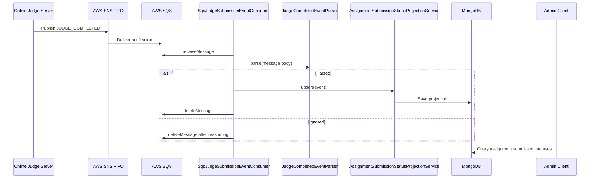

# Judge Completed

> 상위 문서로 돌아가기: [API / Event Flow Index](./README.md)

본 문서는 Online Judge Server의 `JUDGE_COMPLETED` 이벤트를 소비하고 관리자 제출 현황에 반영하는 흐름을 정리합니다.

## Event payload

```json
{
  "eventType": "JUDGE_COMPLETED",
  "publicCode": "A00123",
  "problemId": "assignment-id",
  "score": 100,
  "passedCases": 10,
  "totalCases": 10,
  "timestamp": "2026-04-09T02:15:30.123Z"
}
```

| 필드 | WEB 내부 의미 |
| :--- | :--- |
| `publicCode` | 수강생 공개 코드 |
| `problemId` | assignment id로 저장 |
| `score` | 최신 또는 최고 점수 판단 기준 |
| `passedCases` | 통과 케이스 수 |
| `totalCases` | 전체 케이스 수 |
| `timestamp` | 채점 완료 이벤트 시각 |

## Consumer flow



## Parser 기준

| 상황 | 결과 |
| :--- | :--- |
| direct JSON body | payload 그대로 파싱 |
| SNS envelope body | `Message` 문자열을 다시 JSON으로 파싱 |
| `eventType` 누락 | `Ignored("missing_event_type")` |
| `eventType != JUDGE_COMPLETED` | `Ignored("unsupported_event_type:{eventType}")` |
| JSON 오류 | `Ignored("invalid_json:{Exception}")` |
| 필수 필드 누락 | `Ignored("missing_*")` |

## Projection merge 기준

`AssignmentSubmissionStatusProjectionService`는 assignmentId/publicCode 단위 projection을 저장합니다.

| 조건 | 반영 기준 |
| :--- | :--- |
| 기존 projection 없음 | submitted=true로 새 projection 생성 |
| score 증가 | latest score와 testcase count 갱신 |
| score 동일, timestamp 최신 | latest 값 갱신 |
| score 낮음 | first/last completed time은 갱신하되 latest score는 유지 |
| DuplicateKey/OptimisticLocking | 최대 5회 retry |

## 관리자 제출 현황 조회

`AdminAssignmentSubmissionStatusesV2Service`는 다음 데이터를 조합합니다.

1. 관리자 과제 상세 조회로 assignment 존재 확인
2. 코스 수강생 목록 조회
3. assignmentId 기준 projection 조회
4. report user 표시 정보 조회
5. 수강생별 submitted, score, passedCases, totalCases, completedAt 응답

## 설정 기준

| 설정 | 설명 |
| :--- | :--- |
| `REPORT_JUDGE_SUBMISSION_EVENTS_ENABLED` | consumer 활성화 |
| `REPORT_JUDGE_SUBMISSION_EVENTS_QUEUE_URL` | SQS queue URL |
| `AWS_REGION` | AWS region |
| `REPORT_JUDGE_SUBMISSION_EVENTS_WAIT_TIME_SECONDS` | long polling wait time |
| `REPORT_JUDGE_SUBMISSION_EVENTS_MAX_MESSAGES` | batch message count |
| `REPORT_JUDGE_SUBMISSION_EVENTS_VISIBILITY_TIMEOUT_SECONDS` | visibility timeout |

## 검증 근거

- `JudgeCompletedEventParserTest`: direct JSON, SNS envelope, ignored event 파싱
- `SqsJudgeSubmissionEventConsumerTest`: message 처리, deleteMessage 기준, receive option
- `AssignmentSubmissionStatusProjectionServiceTest`: projection merge와 retry
- `AdminAssignmentSubmissionStatusesV2ServiceTest`: 관리자 제출 현황 response 조합

## 관련 문서

- [Event-driven Sync](../event-driven-sync.md)
- [Judge Completion 이벤트 소비 흐름](./judge-completion-consumer-flow.md)
- [SQS Envelope Format](../troubleshooting/sqs-envelope-format.md)
