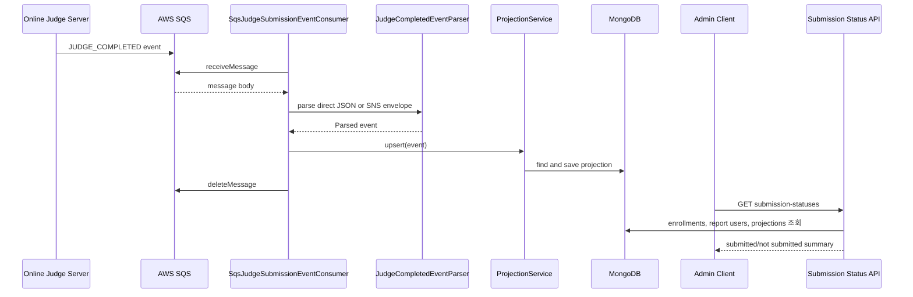

# Judge Completion 이벤트 소비 흐름

## 1. 이 흐름이 필요한 이유

채점 실행과 결과 생성은 Online Judge Server가 담당한다.
A&I Web Server는 OJ가 발행한 `JUDGE_COMPLETED` 이벤트를 받아 과제별 제출 상태 projection을 갱신하고, 관리자 화면에서 제출/미제출 현황을 조회할 수 있게 한다.

## 2. 참여 컴포넌트

| 컴포넌트 | 역할 |
| :--- | :--- |
| `SqsJudgeSubmissionEventConsumer` | SQS 메시지를 polling하고 처리 |
| `JudgeCompletedEventParser` | direct JSON과 SNS envelope body를 파싱 |
| `AssignmentSubmissionStatusProjectionService` | 과제/사용자별 제출 상태 projection upsert |
| `AssignmentSubmissionStatusProjectionRepository` | projection 저장소 |
| `CourseAdminAssignmentSubmissionStatusesV2Controller` | 관리자 제출 현황 조회 API |
| `AdminAssignmentSubmissionStatusesV2Service` | 수강생 목록과 projection을 조합 |
| `AWS SQS` | OJ 채점 완료 이벤트 소비 대상 |
| `MongoDB` | projection과 사용자/수강 정보 저장소 |

## 3. 동작 과정 요약

1. `REPORT_JUDGE_SUBMISSION_EVENTS_ENABLED=true`이면 SQS consumer가 자동 시작된다.
2. consumer는 `REPORT_JUDGE_SUBMISSION_EVENTS_QUEUE_URL`에서 메시지를 polling한다.
3. parser는 direct JSON body와 SNS envelope의 `Message` body를 모두 지원한다.
4. `eventType`이 `JUDGE_COMPLETED`가 아니면 로그를 남기고 메시지를 삭제한다.
5. 정상 이벤트는 projection에 upsert한 뒤 메시지를 삭제한다.
6. 관리자 제출 현황 API는 코스 수강생 목록과 projection을 `publicCode` 기준으로 연결한다.

## 4. API / Event 계약

### Event

| 필드 | 설명 |
| :--- | :--- |
| `eventType` | `JUDGE_COMPLETED` |
| `publicCode` | 제출자를 식별하는 공개 코드 |
| `problemId` | 과제 UUID로 사용 |
| `score` | 채점 점수 |
| `passedCases` | 통과 테스트케이스 수 |
| `totalCases` | 전체 테스트케이스 수 |
| `timestamp` | 채점 완료 시각 |

### API

| Method | Path | 설명 |
| :--- | :--- | :--- |
| `GET` | `/v2/admin/courses/{courseSlug}/assignments/{assignmentId}/submission-statuses` | 관리자용 과제 제출 현황 조회 |

## 5. Sequence Diagram

## 6. 예외 흐름

| 조건 | 처리 |
| :--- | :--- |
| JSON 파싱 실패 | `invalid_json`으로 무시하고 메시지 삭제 |
| `eventType` 누락 또는 `JUDGE_COMPLETED` 아님 | reason 로그를 남기고 메시지 삭제 |
| 필수 필드 누락 | reason 로그를 남기고 메시지 삭제 |
| projection 저장 실패 | 메시지를 삭제하지 않으며 visibility timeout 이후 재수신 대상이 됨 |
| 동일 점수 이벤트 재수신 | 점수가 높거나 같은 점수에서 timestamp가 최신이면 latest 값을 갱신 |

## 7. 확인한 코드 위치

- `src/main/kotlin/com/example/aandi_post_web_server/assignment/infrastructure/submission/event/SqsJudgeSubmissionEventConsumer.kt`
- `src/main/kotlin/com/example/aandi_post_web_server/assignment/infrastructure/submission/event/JudgeCompletedEventParser.kt`
- `src/main/kotlin/com/example/aandi_post_web_server/assignment/application/submission/service/AssignmentSubmissionStatusProjectionService.kt`
- `src/main/kotlin/com/example/aandi_post_web_server/course/api/v2/controller/CourseAdminAssignmentSubmissionStatusesV2Controller.kt`
- `src/main/kotlin/com/example/aandi_post_web_server/assignment/application/service/AdminAssignmentSubmissionStatusesV2Service.kt`
- `src/main/resources/application.yml`

## 8. README에는 이렇게 요약한다

OJ 채점 완료 이벤트를 SQS로 소비해 제출 상태 projection에 반영하고, 관리자 API에서 수강생별 제출 여부와 최고 점수 요약을 조회한다.
