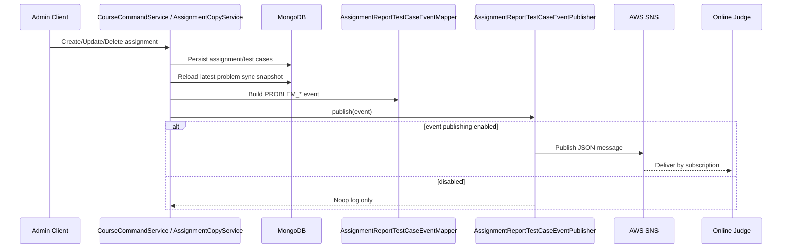

# Problem Sync

> 상위 문서로 돌아가기: [API / Event Flow Index](./README.md)

본 문서는 Assignment 변경 후 Online Judge problem sync 이벤트를 발행하는 흐름을 정리합니다.

## Event payload

```kotlin
data class AssignmentReportTestCaseEvent(
    val eventType: AssignmentReportTestCaseEventType,
    val problemId: String,
    val testCases: List<AssignmentReportTestCase>,
)
```

| 필드 | 설명 |
| :--- | :--- |
| `eventType` | `PROBLEM_CREATED`, `PROBLEM_UPDATED`, `PROBLEM_DELETED` |
| `problemId` | assignment id |
| `testCases[].caseId` | testcase seq |
| `testCases[].input` | solution args로 전달할 input values |
| `testCases[].output` | expected output |

## Event type 기준

| 이벤트 | 발생 조건 | testcase 기준 |
| :--- | :--- | :--- |
| `PROBLEM_CREATED` | 과제 생성 또는 복사 완료 | `EXCLUDED` 제외, seq 정렬 |
| `PROBLEM_UPDATED` | 과제 수정 완료 | `EXCLUDED` 제외, 최신 전체 snapshot |
| `PROBLEM_DELETED` | 과제 삭제 완료 | 빈 배열 `[]` |

## Publish flow



## 설정 기준

| 설정 | 설명 |
| :--- | :--- |
| `APP_EVENTS_REPORT_TEST_CASE_ENABLED` | problem sync publish 활성화 |
| `APP_EVENTS_REPORT_TEST_CASE_SNS_TOPIC_ARN` | SNS topic ARN |
| `APP_EVENTS_REPORT_TEST_CASE_REGION` | AWS region, 기본 `ap-northeast-2` |

`APP_EVENTS_REPORT_TEST_CASE_ENABLED=true`인데 topic ARN이 비어 있으면 시작 단계에서 예외를 발생시킵니다.

## FIFO topic 기준

`SnsAssignmentReportTestCaseEventPublisher`는 topic ARN이 `.fifo`로 끝나면 다음 필드를 추가합니다.

| 필드 | 값 |
| :--- | :--- |
| `messageGroupId` | `event.problemId` |
| `messageDeduplicationId` | random UUID |

## 실패 처리

| 상황 | 처리 |
| :--- | :--- |
| SNS publish 성공 | eventType, problemId, messageId 로그 |
| SNS publish 실패 | eventType, problemId, topicArn 로그 후 오류 전파 |
| publish 비활성화 | skip 로그 후 `Mono.empty()` |

## 검증 근거

- `AssignmentReportTestCaseEventMapperTest`: created/updated/deleted payload mapping
- `SnsAssignmentReportTestCaseEventPublisherTest`: SNS publish request와 실패 전파
- `AssignmentReportTestCaseEventConfigTest`: enabled/topic ARN 설정 검증
- `CourseCommandServiceTest`: 과제 생성/수정/삭제 후 이벤트 타입 검증

## 관련 문서

- [Event-driven Sync](../event-driven-sync.md)
- [테스트케이스 OJ 동기화 흐름](./testcase-oj-sync-flow.md)
- [Event Field Consistency](../troubleshooting/event-field-consistency.md)
