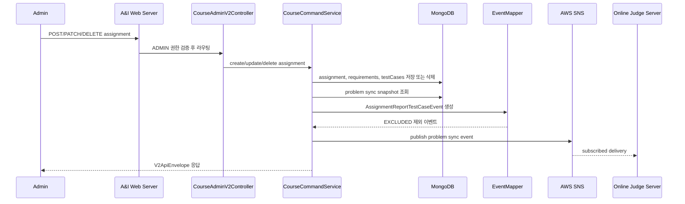

# 테스트케이스 Online Judge 동기화 흐름

## 1. 이 흐름이 필요한 이유

과제의 테스트케이스는 Web Server에서 관리하지만, 실제 채점 문제는 Online Judge Server가 사용한다.
관리자가 과제를 생성, 수정, 삭제하면 Web Server는 최종 테스트케이스 snapshot을 문제 동기화 이벤트로 발행해 두 서버의 문제 데이터를 맞춘다.

## 2. 참여 컴포넌트

| 컴포넌트 | 역할 |
| :--- | :--- |
| `CourseAdminV2Controller` | 관리자 과제 생성/수정/삭제/복사 API 진입점 |
| `CourseCommandService` | 과제 저장, 요구사항/테스트케이스 저장, problem sync 이벤트 발행 |
| `AssignmentCopyService` | 원본 과제를 대상 코스로 복사하고 생성 이벤트 발행 |
| `AssignmentReportTestCaseEventMapper` | 과제와 테스트케이스를 OJ problem sync 이벤트로 변환 |
| `AssignmentReportTestCaseEventPublisher` | 이벤트 발행 인터페이스 |
| `SnsAssignmentReportTestCaseEventPublisher` | SNS topic으로 이벤트 발행 |
| `NoopAssignmentReportTestCaseEventPublisher` | 기능 비활성화 시 로그만 남김 |
| `AWS SNS` | OJ로 전달될 problem sync 이벤트 발행 대상 |
| `MongoDB` | 과제와 테스트케이스 저장소 |

## 3. 동작 과정 요약

1. 관리자가 과제 생성/수정/삭제/복사 API를 호출한다.
2. 서버는 코스, 주차, 과제 슬롯 중복, 요청값을 검증한다.
3. 과제 본문, 요구사항, 테스트케이스를 MongoDB에 저장하거나 삭제한다.
4. 저장된 과제와 테스트케이스를 다시 읽어 problem sync snapshot을 만든다.
5. `EXCLUDED` 테스트케이스를 제외하고 `PROBLEM_CREATED`, `PROBLEM_UPDATED`, `PROBLEM_DELETED` 이벤트를 발행한다.

## 4. API / Event 계약

### API

| Method | Path | 설명 |
| :--- | :--- | :--- |
| `POST` | `/v2/admin/courses/{courseSlug}/assignments` | 과제 생성 |
| `POST` | `/v2/admin/courses/{targetCourseSlug}/assignments/copy` | 과제 복사 |
| `PATCH` | `/v2/admin/courses/{courseSlug}/assignments/{assignmentId}` | 과제 수정 |
| `DELETE` | `/v2/admin/courses/{courseSlug}/assignments/{assignmentId}` | 과제 삭제 |

### Event

| 필드 | 설명 |
| :--- | :--- |
| `eventType` | `PROBLEM_CREATED`, `PROBLEM_UPDATED`, `PROBLEM_DELETED` |
| `problemId` | 과제 UUID |
| `testCases[].caseId` | 테스트케이스 `seq` |
| `testCases[].input` | 테스트케이스 `inputValues` 배열 |
| `testCases[].output` | 테스트케이스 `outputText` |

`PROBLEM_DELETED` 이벤트는 `testCases: []`로 발행된다.
SNS topic ARN은 `APP_EVENTS_REPORT_TEST_CASE_SNS_TOPIC_ARN`으로 주입한다.

## 5. Sequence Diagram

## 6. 예외 흐름

| 상태 | 조건 |
| :--- | :--- |
| `400` | 날짜 역전, 잘못된 UUID, 잘못된 주차/순번, 테스트케이스 형식 오류 |
| `403` | ADMIN 권한 없음 |
| `404` | 코스, 주차, 과제, 원본 과제를 찾을 수 없음 |
| `409` | 동일 코스/주차/순번 중복 또는 동일 원본/동일 내용 과제 복사 중복 |
| `500` 가능 | SNS 발행 실패가 발생하면 발행 결과가 API 흐름에 전파됨 |

## 7. 확인한 코드 위치

- `src/main/kotlin/com/example/aandi_post_web_server/course/api/v2/controller/CourseAdminV2Controller.kt`
- `src/main/kotlin/com/example/aandi_post_web_server/course/application/service/CourseCommandService.kt`
- `src/main/kotlin/com/example/aandi_post_web_server/assignment/application/service/AssignmentCopyService.kt`
- `src/main/kotlin/com/example/aandi_post_web_server/assignment/infrastructure/event/AssignmentReportTestCaseEventMapper.kt`
- `src/main/kotlin/com/example/aandi_post_web_server/assignment/infrastructure/event/SnsAssignmentReportTestCaseEventPublisher.kt`
- `src/main/resources/application.yml`

## 8. README에는 이렇게 요약한다

관리자가 과제를 생성/수정/삭제하면 서버는 `EXCLUDED`를 제외한 테스트케이스 snapshot을 OJ problem sync 이벤트로 발행한다.
