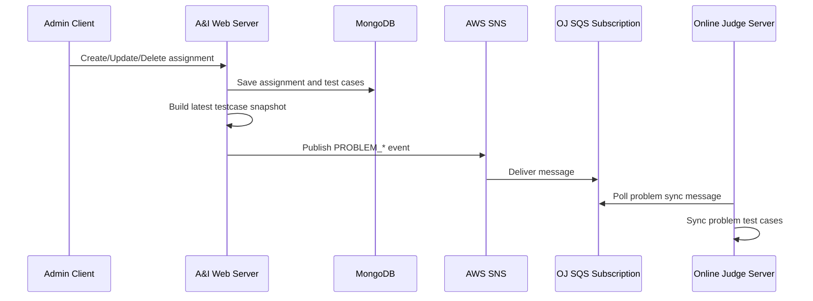
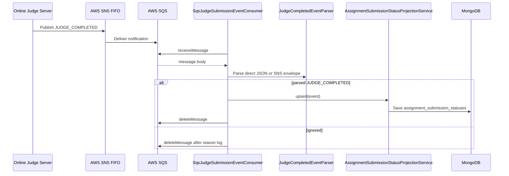
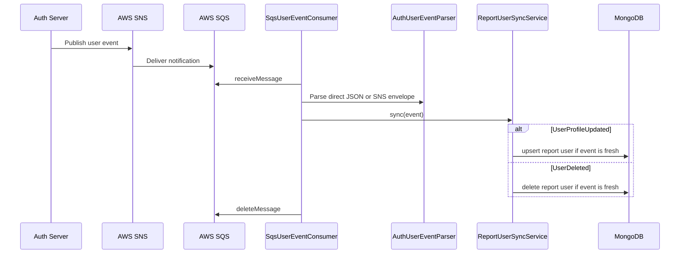

# Event-driven Sync

> 메인 README로 돌아가기: [README](../README.md)

본 문서는 A&I Web Server가 SNS/SQS 기반으로 외부 시스템과 동기화하는 근거를 정리합니다.

## 전체 흐름

| 흐름 | 생산자 | 전달 경로 | 소비자 | 이벤트 타입 |
| :--- | :--- | :--- | :--- | :--- |
| Online Judge Problem Sync | WEB | WEB -> SNS -> OJ 구독 SQS | Online Judge Server | `PROBLEM_CREATED`, `PROBLEM_UPDATED`, `PROBLEM_DELETED` |
| Judge Completed Event | Online Judge Server | OJ -> SNS FIFO -> SQS | WEB `SqsJudgeSubmissionEventConsumer` | `JUDGE_COMPLETED` |
| Auth User Sync | Auth Server | AUTH -> SNS -> SQS | WEB `SqsUserEventConsumer` | `UserProfileUpdated`, `UserDeleted` |

## WEB -> SNS -> SQS -> OJ problem sync

과제 생성, 수정, 삭제 후 WEB 서버는 최신 테스트케이스 snapshot을 SNS로 발행합니다. `EXCLUDED` 테스트케이스는 payload에서 제외하고, 삭제 이벤트는 같은 `problemId`에 `testCases: []`를 보냅니다.



| 항목 | 기준 |
| :--- | :--- |
| 생성 | `AssignmentReportTestCaseEventMapper.created`가 `PROBLEM_CREATED` 생성 |
| 수정 | `AssignmentReportTestCaseEventMapper.updated`가 `PROBLEM_UPDATED` 생성 |
| 삭제 | `AssignmentReportTestCaseEventMapper.deleted`가 `PROBLEM_DELETED`, `testCases = emptyList()` 생성 |
| 발행 꺼짐 | `NoopAssignmentReportTestCaseEventPublisher`가 skip 로그만 남김 |
| 발행 켜짐 | `APP_EVENTS_REPORT_TEST_CASE_SNS_TOPIC_ARN` 누락 시 시작 단계에서 예외 |
| FIFO topic | topic ARN이 `.fifo`로 끝나면 `problemId`를 `messageGroupId`로 사용 |

## OJ -> SNS FIFO -> SQS -> WEB judge completed

WEB 서버는 OJ의 채점 완료 이벤트를 SQS에서 읽어 제출 상태 projection을 갱신합니다.



| 항목 | 기준 |
| :--- | :--- |
| 활성화 | `REPORT_JUDGE_SUBMISSION_EVENTS_ENABLED` 또는 `APP_EVENTS_JUDGE_SUBMISSION_ENABLED` |
| queue URL | `REPORT_JUDGE_SUBMISSION_EVENTS_QUEUE_URL` 또는 `APP_EVENTS_JUDGE_SUBMISSION_QUEUE_URL` |
| 필수 필드 | `publicCode`, `problemId`, `score`, `passedCases`, `totalCases`, `timestamp` |
| 비대상 이벤트 | `eventType` 누락 또는 `JUDGE_COMPLETED`가 아니면 `Ignored(reason)` |
| projection merge | 최고 점수 우선, 동점이면 최신 이벤트 시각 우선 |
| 삭제 기준 | parsed/ignored 메시지는 처리 후 `deleteMessage`; 처리 예외는 로그 후 삭제하지 않음 |

## AUTH -> SNS -> SQS -> WEB user sync

AUTH 서버의 사용자 변경 이벤트는 WEB 서버의 report user 데이터로 동기화됩니다.



| 항목 | 기준 |
| :--- | :--- |
| 활성화 | `APP_EVENTS_USER_SYNC_ENABLED=true` |
| queue URL | `APP_EVENTS_USER_SYNC_QUEUE_URL` |
| 이벤트 타입 | `UserProfileUpdated`, `UserDeleted` |
| fresh 판단 | `updatedAt` 우선, 없으면 `occurredAt` |
| stale 처리 | 저장된 `updatedAt`보다 오래된 이벤트는 `IGNORED_STALE` |

## Direct JSON body와 SNS envelope body

`JudgeCompletedEventParser`와 `AuthUserEventParser`는 공통적으로 SQS body가 곧 이벤트 JSON인 경우와 SNS notification envelope인 경우를 모두 처리합니다.

```json
{
  "eventType": "JUDGE_COMPLETED",
  "publicCode": "A00123",
  "problemId": "assignment-id",
  "score": 100,
  "passedCases": 10,
  "totalCases": 10,
  "timestamp": "2026-04-09T02:15:30.123Z"
}
```

```json
{
  "Type": "Notification",
  "Message": "{\"eventType\":\"JUDGE_COMPLETED\",\"publicCode\":\"A00123\",\"problemId\":\"assignment-id\",\"score\":100,\"passedCases\":10,\"totalCases\":10,\"timestamp\":\"2026-04-09T02:15:30.123Z\"}"
}
```

## 실패 처리 기준

| 상황 | 처리 |
| :--- | :--- |
| Problem sync SNS publish 실패 | publisher error가 reactive chain에 전파되며 로그를 남김 |
| Judge event JSON 파싱 실패 | `Ignored(invalid_json:...)`로 처리하고 메시지 삭제 |
| Judge event 필수 필드 누락 | `Ignored(missing_...)`로 처리하고 메시지 삭제 |
| Judge projection upsert 실패 | error 로그 후 메시지 삭제하지 않음 |
| User sync parser/service 실패 | error 로그 후 메시지 삭제하지 않음 |

## 관련 문서

- [Problem Sync](./api-flows/problem-sync.md)
- [Judge Completed](./api-flows/judge-completed.md)
- [Auth User Sync](./api-flows/auth-user-sync.md)
- [SQS Envelope Format](./troubleshooting/sqs-envelope-format.md)
