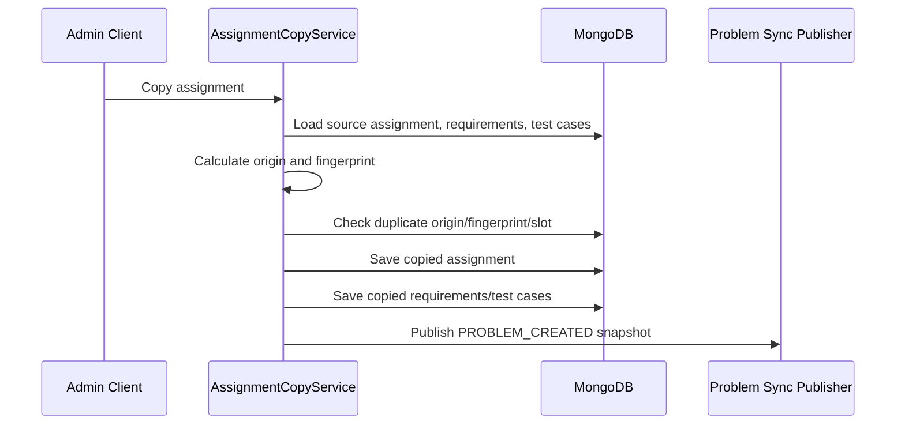

# Assignment Copy

> 상위 문서로 돌아가기: [Troubleshooting](./README.md)

과제 복사는 운영 반복 작업을 줄이지만, 같은 과제를 여러 번 복사하거나 일부 저장 후 실패하는 상황을 고려해야 합니다.

## 구현 위치

| 파일 | 역할 |
| :--- | :--- |
| `AssignmentCopyService.kt` | 과제 복사 전체 흐름 |
| `AssignmentCopyFingerprintCalculator.kt` | 과제 내용 기반 fingerprint 계산 |
| `Assignment.kt` | origin/fingerprint unique compound index 선언 |

## 중복 방지 기준

| 기준 | 설명 |
| :--- | :--- |
| `originAssignmentId` | 같은 원본 과제를 같은 코스에 중복 복사하지 않도록 확인 |
| `copyFingerprint` | origin이 달라도 내용이 같은 과제가 중복 생성되지 않도록 확인 |
| `courseId + weekNo + orderInWeek` | 같은 코스/주차/순번 중복 방지 |

## 복사 흐름

## 실패 처리 기준

| 상황 | 처리 |
| :--- | :--- |
| sourceAssignmentId blank | `400 BAD_REQUEST` |
| 원본 과제 없음 | `404 NOT_FOUND` |
| target endAt < startAt | `400 BAD_REQUEST` |
| origin/fingerprint/slot 중복 | `409 CONFLICT` |
| requirement/testcase 복사 중 실패 | 생성된 assignment cleanup 시도 후 오류 반환 |
| 복사 성공 | `PROBLEM_CREATED` problem sync 발행 |

## 운영 점검

- 같은 원본 과제를 다시 복사했을 때 `409 CONFLICT`가 반환되는지 확인합니다.
- 내용이 같은 과제를 다른 원본 경로로 복사할 때 fingerprint 중복이 잡히는지 확인합니다.
- 복사 성공 후 `Publishing assignment problem sync event` 로그와 `PROBLEM_CREATED` 이벤트를 확인합니다.

## 관련 테스트

- `AssignmentCopyFingerprintCalculatorTest`
- `CourseCommandServiceTest`
- `AssignmentIndexTest`
